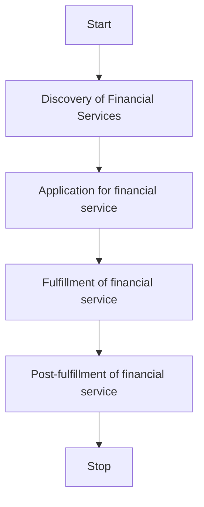
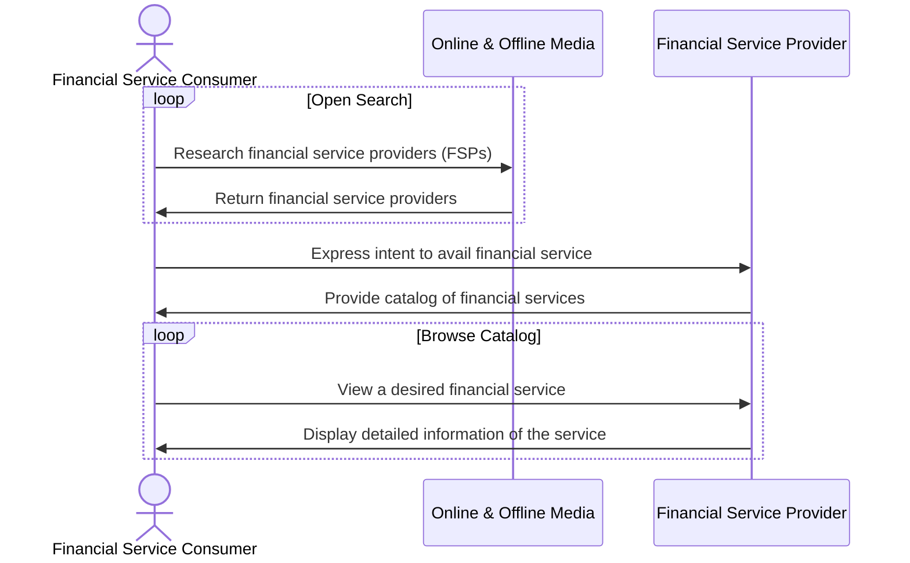

# 4. A General Workflow for Availing Financial Services

## 4.1 Overview

Any financial services application consists of the following flow. 

Each of these steps consist of one or more interactions that allow a financial service consumer (FSC) to avail services offered by a financial services provide (FSP). These financial services can be anything ranging from Insurance, Mutual Funds, Credit, or any other service. 

A typical workflow for a financial service transaction consits of the following steps.
1. Discovery of Financial Services
2. Application for a Financial Service
3. Fulfillment of the Financial Service
4. Post-fulfillment of Financial Services

## 4.2 Architecture

Typically, transactions in financial services occur via interactions across multiple layers like,

1. Transactions : To facilitate the discovery, application, fulfillment, and post-fulfillment interactions. Implemented using beckn protocol APIs
2. Forms : To transmit form-based information requested by either party during a transaction
3. Consent : To manage consented data sharing, especially when sharing financial records
4. Payments : To facilitate payments 
5. Identity : To declare and verify identities for KYC purposes
6. Credentialing : To declare and verify credentials for calculation of premiums, credit worthiness, etc

Depending on the sophistication of implementation, the user on either side might interact with each layer independently, or on a single user interface. This document does not assume any particular architecture. 

The recommendations of **Decentralized Financial Services Protocol** is limited only to the transaction layer and to some extent, the forms layer. Interactions in the remaining layers like Consent, Payments, Identity, Credentials, etc are managed by their respective protocols. Implementers are recommended to adhere to the protocols mandated or recommended by their respective network facilitator organizations for such layers.

Below is an illustration of how a decentralized multi-layered financial services ecosystem might look like.

## 4.3 Discovery of Financial Services

The logical workflow for the discovery of a financial service is shown below

Let us look at these steps in detail. 

### 4.3.1 FSC discovers an FSP 
The consumer researches various financial service providers through known  aggregators, search engines, broadcast media, personal connections etc. 

An FSC can search for an FSP in many ways like
- Searching for a FSPs, (say, a bank) by its name or code
- Searching for FSPs based on rating
- Searching for financial services by their names
- Searching for financial services by their category name
- Searching for financial services by amount

Eventually, the FSC discovers an FSP that matches their requirement.

### 4.3.2 FSC browses through various products of an FSP
In this step, the FSC discovers an FSP and browses through the various financial sevice products in its catalog.

In this interaction, the FSP publishes their catalog of products. A FSP can publish various types of catalogs like,
- Catalog of Financial Service Products
- Catalog of Financial Service Categories

### 4.3.3 FSC views a particular product of an FSP
In this step, the FSC discovers a desired financial service in the catalog and views its details. 

## 4.4 Application for a Financial Service
In this stage, the FSC selects a particular financial product and begins the process of applying for it. During the process of application, there are several sub-interactions that happen between the FSC and the FSP. 

### 4.4.1 FSC selects a service
In this step, the FSC requests an offer made by the FSP. In contrast to typical commercial transactions, in financial services, the application typically begins by providing the FSP with some information. This information is provided via a form submission containing all the relevant information. Sometimes, the provider might also request the consumer to share financial records like  transaction records, invoicing history, or any other information that belongs to the FSC. In some modern financial service applications, the fetching of information can also happen via an electronic consent request made by the FSP to the FSC. Once the consent is given by the consumer, the FSP pulls the financial records through the consent infrastructure.

### 4.4.2 FSP processes the financial information and returns an offer
Once the financial information is fetched, the FSP processes the financial information provided by the FSC and returns an offer. This offer may not necessarily be the final offer, but more like an indication of what the FSC is eligible for. Receipt of an offer is not a guarantee of the final offer made by the FSP to the FSC.

### 4.4.3 FSC accepts the offer
In this step, the FSC accepts the offer. Sometimes, the FSP requests for additional information from the FSC in order to finalize the application. This too can happen via a simple form submission or via a consent request, or both. 

### 4.4.4 FSP generates the final agreement
In this step, the FSP generates the final agreement with the final offer, the terms of service.

### 4.4.5 FSC signs the agreement
In this step, the FSC signs the agreement and confirms the application.

### 4.4.6 FSP confirms the application
In this step, the FSP returns the finalized application with the latest status.

## 5. Fulfillment of the Financial Service
In this stage, the application is confirmed and the FSP initiates the fulfillment of the financial service. In the case of credit, it could mean the actual disbursal of the loan. In the case of insurance, it could mean claiming an insurance, or a request for a premium to be deposited. In the case of mutual funds, it could be a request for a SIP payment. Furthermore, in this stage, the FSC can also cancel the service due to various reasons. Sometimes, the FSP can also update the terms of service based on events at the FSP or the FSC's end like an advance payment of the loan. Update of bank account, etc. As always, the Fulfillment stage of a financial service can be composed of further sub-interactions. Let us look at the types of interactions possible at this stage. 

### 5.1 Status Updates
During the fulfillment stage, the FSC might request status updates regarding their application. In response to this, the FSP can provide various status update regarding the processing of the application like, "submitted", "processing", "sanctioned", etc. These status updates may be arbitrary, depending upon the nature of the transaction.

Furthermore, the FSP also might independently send status updates to the FSP as-and-when the status of the application changes. 

### 5.2 Terms Update
Sometimes, the FSC might request some updates to the terms of service. For example, updating account information, a request to update the premium, or rate of interest for a loan, etc. These updates can be triggered basis multiple factors like pre-payment in the case of credit. Sometimes, a fitness report shared by the FSC to the FSP might result in a better premium for an insurance product.

Furthermore, the FSP might independently update the terms of service without being explicitly requested by the FSC. As mentioned earlier, the cause of the update of terms of service may depend on various factors like additional information submitted, credentials, received, policy changes etc.

### 5.3 Cancellation of Service
Sometimes, the FSC might request to cancel an ongoing transaction. For example, a borrower might cancel a loan application before it has been disbursed. An insurance policy holder might want to terminate their engagement with an insurance provider; or an investor holding a mutual fund might want to terminate their SIP. 

On the other hand, the FSP might want to independently cancel a transaction. This cancellation might depend on various factors like information received, loss of credentials on the consumer end due to defaulting, policy changes etc.

### 5.4 Real-time Tracking
Real-time tracking in financial services is pretty uncommon but sometimes the FSP might want to share real-time tracking information about a service. This can occur in scenarios when the FSC has manually sent some documents that require real-time tracking. 

## 6. Post-fulfillment of Financial Services
In this stage, all the events that happen after the financial service is fulfilled can happen. For example, rating a service, contacting support, settlements, and defaults. 

### 6.1 Rating a service
Rating a service is an important part of any transaction. At the end of fulfillment, FSPs usually expect a feedback from the consumer on the quality of service rendered. 

### 6.2 Contacting Support
sometimes the financial service consumer might want to contact the support center of the financial service provider. When requested, the FSP returns the contact information of their support center in the form of a phone number, email address, or a via a chat url.

