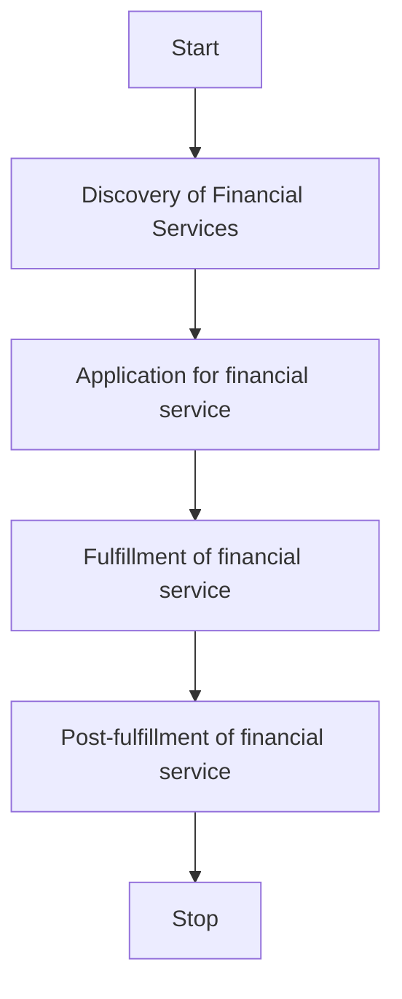
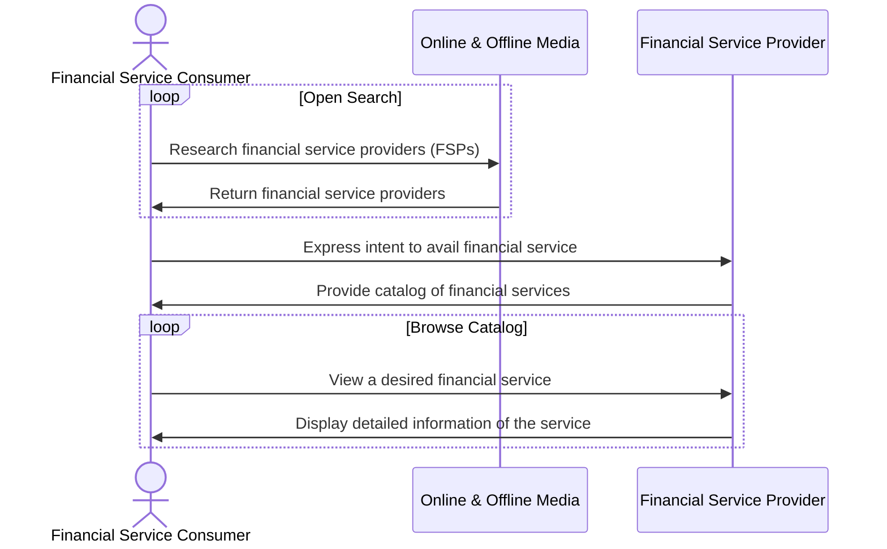

# A General Workflow for Availing Financial Services

## Authors
1. Ravi Prakash - FIDE
2. Hrushikesh Mehta - ONDC
3. Antriksh Parmar - ONDC

## Overview

Any financial services application consists of the following flow. 

Each of these steps consist of one or more interactions that allow a financial service consumer (FSC) to avail services offered by a financial services provide (FSP). These financial services can be anything ranging from Insurance, Mutual Funds, Credit, or any other service. 

> Note: Bear in mind, this is just an example workflow for a simple transaction between a Consumer and a Provider. The order of interactions between the two parties is arbitratrily selected on the basis of several interviews with subject matter experts.

A typical workflow for a financial service transaction consits of the following steps.
1. Discovery of Financial Services
2. Application for a Financial Service
3. Fulfillment of the Financial Service
4. Post-fulfillment of Financial Services

## 1. Discovery of Financial Services

The logical workflow for the discovery of a financial service is shown below

Let us look at these steps in detail. 

### 1.1: FSC discovers an FSP 
The consumer researches various financial service providers through known  aggregators, search engines, broadcast media, personal connections etc. 

An FSC can search for an FSP in many ways like
- Searching for a FSPs, (say, a bank) by its name or code
- Searching for FSPs based on rating
- Searching for financial services by their names
- Searching for financial services by their category name
- Searching for financial services by amount

Eventually, the FSC discovers an FSP that matches their requirement.

### 1.2 FSC browses through various products of an FSP
In this step, the FSC discovers an FSP and browses through the various financial sevice products in its catalog.

In this interaction, the FSP publishes their catalog of products. A FSP can publish various types of catalogs like,
- Catalog of Financial Service Products
- Catalog of Financial Service Categories

### 1.3 FSC views a particular product of an FSP
In this step, the FSC discovers a desired financial service in the catalog and views its details. 

## 2. Application for a Financial Service
In this stage, the FSC selects a particular financial product and begins the process of applying for it. During the process of application, there are several sub-interactions that happen between the FSC and the FSP. 

### 2.1 FSC selects a service
In this step, the FSC requests an offer made by the FSP. In contrast to typical commercial transactions, in financial services, the application typically begins by providing the FSP with some information. This information is provided via a form submission containing all the relevant information. Sometimes, the provider might also request the consumer to share financial records like  transaction records, invoicing history, or any other information that belongs to the FSC. In some modern financial service applications, the fetching of information can also happen via an electronic consent request made by the FSP to the FSC. Once the consent is given by the consumer, the FSP pulls the financial records through the consent infrastructure.

### 2.2 FSP processes the financial information and returns an offer
Once the financial information is fetched, the FSP processes the financial information provided by the FSC and returns an offer. This offer may not necessarily be the final offer, but more like an indication of what the FSC is eligible for. Receipt of an offer is not a guarantee of the final offer made by the FSP to the FSC.

### 2.3 FSC accepts the offer
In this step, the FSC accepts the offer. Sometimes, the FSP requests for additional information from the FSC in order to finalize the application. This too can happen via a simple form submission or via a consent request, or both. 

### 2.4 FSP generates the final agreement
In this step, the FSP generates the final agreement with the final offer, the terms of service.

### 2.5 FSC signs the agreement
In this step, the FSC signs the agreement and confirms the application.

### 2.6 FSP confirms the application
In this step, the FSP returns the finalized application with the latest status.

## 3. Fulfillment of the Financial Service
In this stage, the application is confirmed and the FSP initiates the fulfillment of the financial service. In the case of credit, it could mean the actual disbursal of the loan. In the case of insurance, it could mean claiming an insurance, or a request for a premium to be deposited. In the case of mutual funds, it could be a request for a SIP payment. Furthermore, in this stage, the FSC can also cancel the service due to various reasons. Sometimes, the FSP can also update the terms of service based on events at the FSP or the FSC's end like an advance payment of the loan. Update of bank account, etc. As always, the Fulfillment stage of a financial service can be composed of further sub-interactions. Let us look at the types of interactions possible at this stage. 

### 3.1 Status Updates

### 3.2 Terms Update

### 3.3 Cancellation of Service

### 3.4 Tracking

## 4. Post-fulfillment of Financial Services
In this stage, all the events that happen after the financial service is fulfilled can happen. For example, rating a service, contacting support, settlements, and defaults. 

### 4.1 Rating a service

### 4.2 Contacting Support

