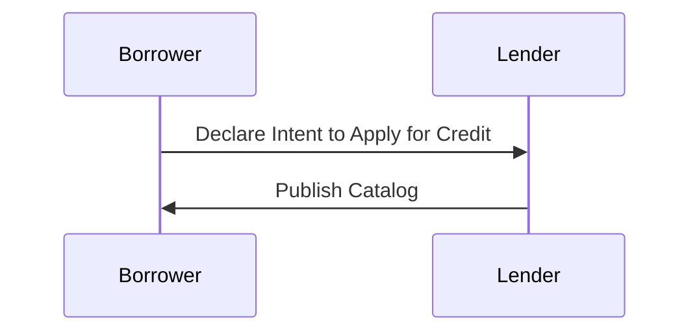
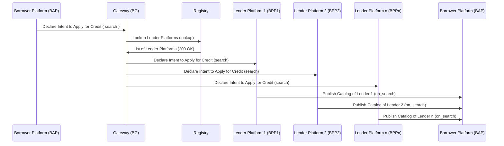
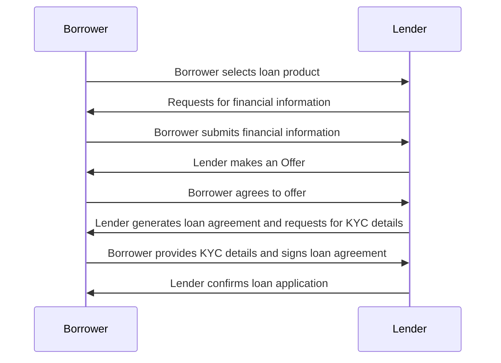
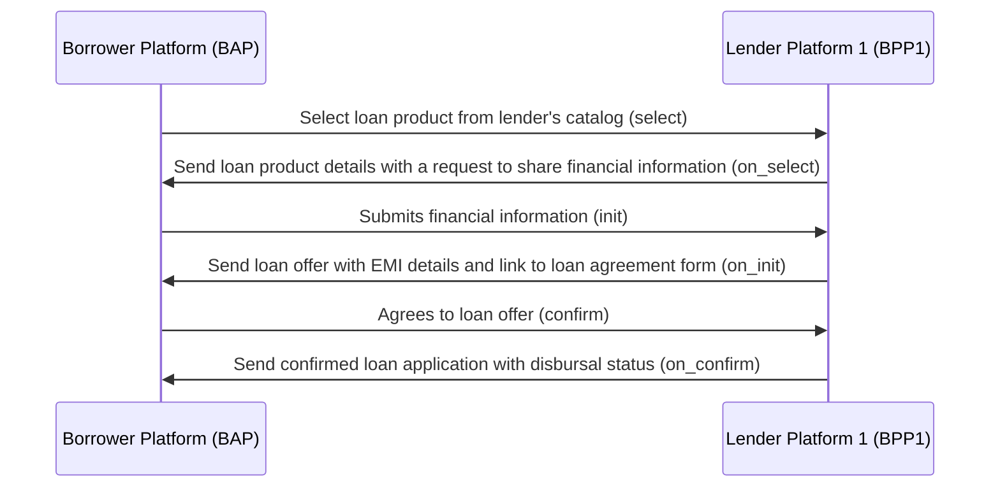
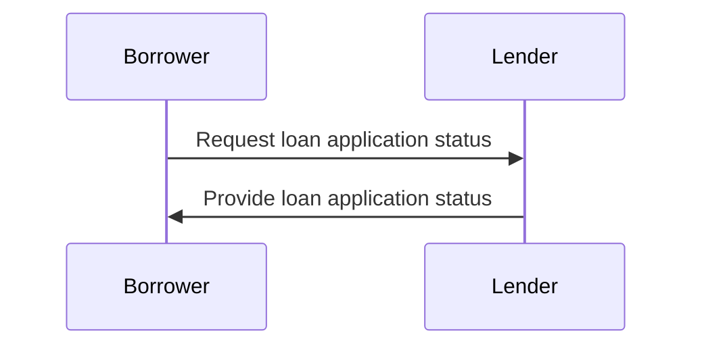
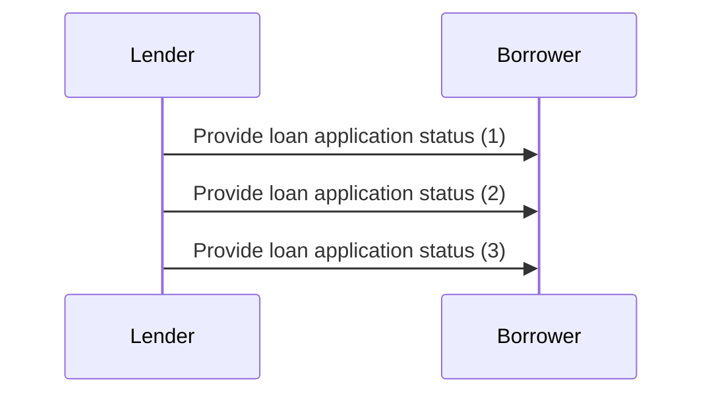
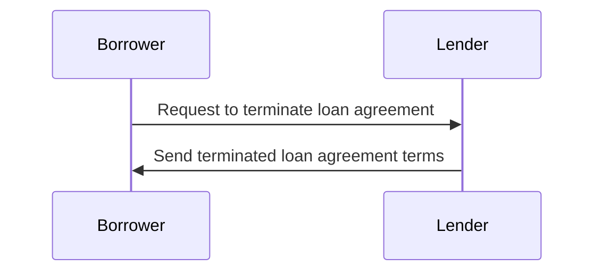
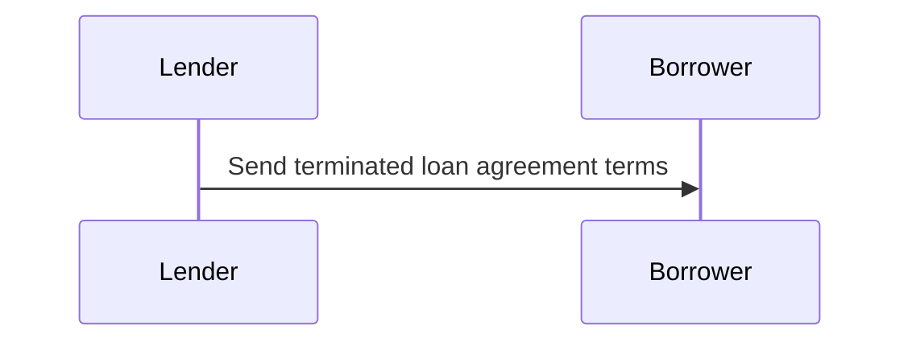
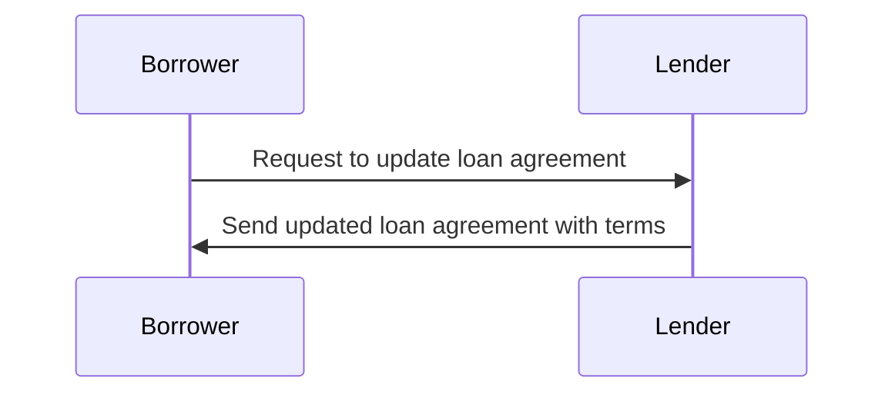
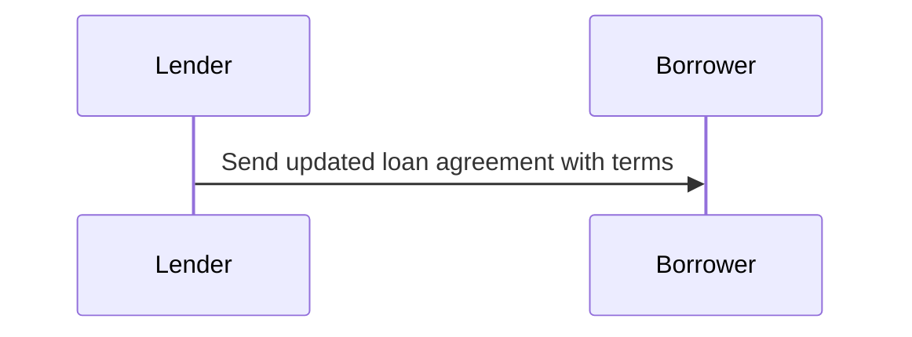

# A Generic Workflow for a Decentralized Credit Application

Any credit application consists of the following interactions. Bear in mind, this is just an example workflow for a simple transaction between a Lender and a Borrower. The order of interactions between the two parties is arbitratrily selected on the basis of several interviews with subject matter experts.

According to beckn protocol, any consumer-provider interaction can be broken down into four stages namely, Discovery, Ordering, Fulfillment and Post-Fulfillment. Without loss of generality, let us break the credit application process into the four stages and describe the subinteractions that occur within them.

## Discovery (Discovering Loan Products)
In this stage, many interactions can happen like,

1. Borrower declares their Intent to one or more Lenders
2. Lender Publishes their Catalog of Loan products

### Borrower-side Actions
A Borrower can declare their intent in many ways like
- Searching for a lender, (say, a bank) by its name or code
- Searching for lenders based on rating
- Searching for loan products by its name / code
- Searching for loan products by its category name / code
- Searching for loan products by loan amount
- Viewing the catalog of loan products of the lender
- Viewing the details of a Lender
- Viewing the details of a particular loan product

### Lender-side Actions
In this interaction, the Lender publishes their catalog of products. A Lender can publish various types of catalogs like,
- Catalog of Loan Products
- Catalog of Loan Product Categories
- Catalog of Lenders
- Catalog containing details of a single vendor
- Catalog of a Lender containing details of a single Loan Product

### Logical Workflow

### Beckn Protocol API Workflow
In beckn protocol, the search intent generated by the Borrower Platform (BAP) is typically published on the gateway (BG) that broadcasts the intent to multiple lender platforms (BPPs). Each of the BPPs return their catalogs directly to the BAP via asynchronous callbacks. The workflow for that is shown below.

## Ordering (Loan Application Stage)
Applying for a loan consists of multiple interactions like,

### Borrower-side actions
1. Selecting lender(s)
2. Submitting a Know your Customer (KYC) form
3. Sharing financial information like Bank Statements, Invoicing Data, etc
4. Signing the Loan Agreement

### Lender-side actions
1. Requesting for financial information
2. Requesting KYC details
3. Making a loan offer
4. Creating the loan agreement

### Logical Workflow

The below diagram illustrates the logical interactions between a borrower and a lender during the Loan Application stage. 

### Beckn Protocol API Workflow

## Fulfillment (Sanction and Disbursal Stage)

In this stage, the loan application has been submitted successfully. During this stage, the borrower or the lender can perform actions like

1. Status updates regarding confirmation, disbursal, repayment etc
2. Termination of a loan application
3. Updating the terms of a loan agreement
4. Requesting additional information

These actions can be initiated at the borrower's end as well as the lender's end.

### Borrower side actions
The borrower can perform the following actions after a loan has been applied

1. Requesting for a status update on the loan application
2. Request to terminate a loan agreement
3. Request to update specific details in the loan application

### Lender-side actions

1. Providing updates on the status of the loan application, disbursal, repayment etc
2. Terminating a loan agreement
3. Updating the terms of a loan agreement or other details

### Logical Workflow

#### Loan Application Status

#### Unsolicited status updates from lender's side

#### Requesting termination of a loan agreement

#### Unsolicited trmination of a loan agreement from lender's side

#### Requesting update of a loan agreement

#### Uncolicited update of a loan agreement from the lender's side

### Beckn Protocol API Workflow

> Everything below this line is Draft

Step 1: Borrower researches and selects a lender
The borrower researches various lenders to find the most suitable options for a personal loan. They compare interest rates, loan terms, eligibility criteria, and customer reviews to make an informed decision.

Step 12: Borrower submits a loan application
The borrower fills out an application form provided by the chosen lender.
The application form typically requires personal details such as name, address, contact information, employment details, income, and other relevant information.

Step 3: Lender reviews the loan application
The lender reviews the loan application submitted by the borrower.
They assess the borrower's eligibility based on factors such as credit score, income stability, employment history, and existing financial obligations.

Step 4: Lender requests additional documentation
If the initial application meets the lender's requirements, they may request additional documentation to verify the borrower's information.
Commonly requested documents include identity proof, address proof, income proof (salary slips, bank statements, income tax returns), employment proof, and any other specific documents mentioned by the lender.

Step 5: Lender evaluates the documents
The lender examines the submitted documents to verify the borrower's details.
They verify the authenticity of the documents and cross-check the information provided in the application form.

Step 7: Lender assesses the creditworthiness
Based on the borrower's credit history, income, and other relevant factors, the lender determines the borrower's creditworthiness.
They evaluate the borrower's ability to repay the loan by considering their debt-to-income ratio, credit score, and other financial aspects.

Step 8: Lender approves or rejects the loan application
After assessing the borrower's creditworthiness, the lender makes a decision on approving or rejecting the loan application.
If approved, the lender communicates the loan amount, interest rate, tenure, and other terms and conditions to the borrower.

Step 9: Borrower accepts the loan offer
If the loan application is approved, the borrower reviews the loan offer provided by the lender.
They carefully read and understand the terms and conditions, interest rate, repayment schedule, and any associated fees or charges.
If satisfied, the borrower accepts the loan offer by signing the loan agreement.

Step 10: Lender disburses the loan amount
Upon receiving the borrower's acceptance, the lender initiates the loan disbursal process.
They transfer the approved loan amount to the borrower's designated bank account.

Step 11: Borrower starts repaying the loan
Once the loan amount is disbursed, the borrower starts making repayments as per the agreed-upon .
They can typically repay the loan through equated monthly instalments (EMIs) via post-dated checks, automatic bank transfers, or online payment methods.

Step 12: Lender monitors loan repayments
The lender keeps track of the borrower's repayments throughout the loan tenure.
They send periodic statements showing the loan balance, EMI due dates, and any other relevant information.

Step 13: Borrower completes loan repayment
The borrower continues repaying the loan as per the agreed schedule until the entire loan amount, along with the applicable interest, is repaid.
Once the loan is fully repaid, the borrower receives a loan closure confirmation from the lender.

