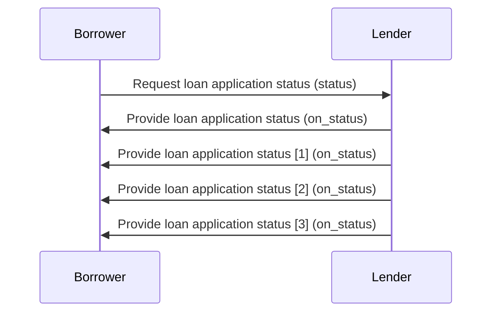
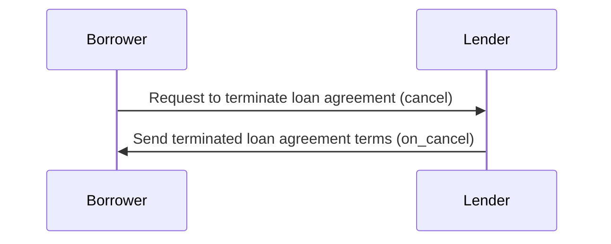
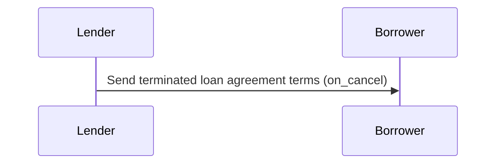
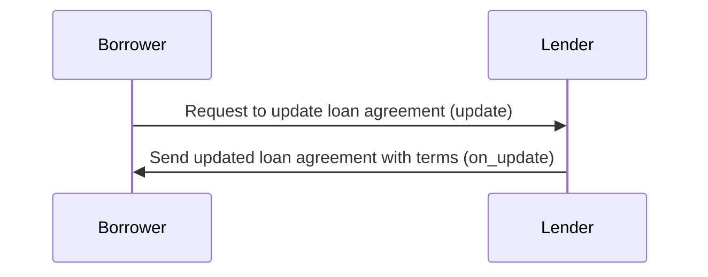
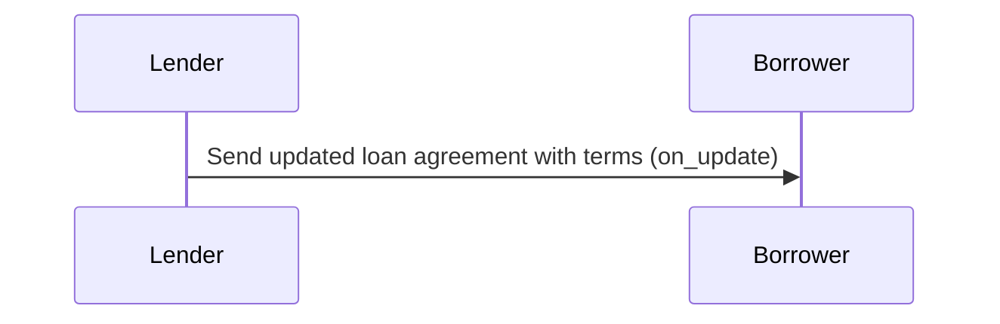
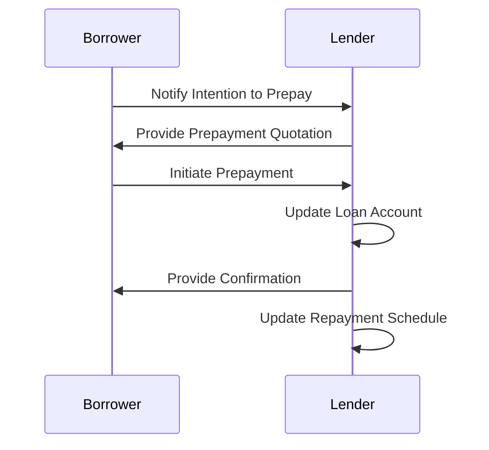
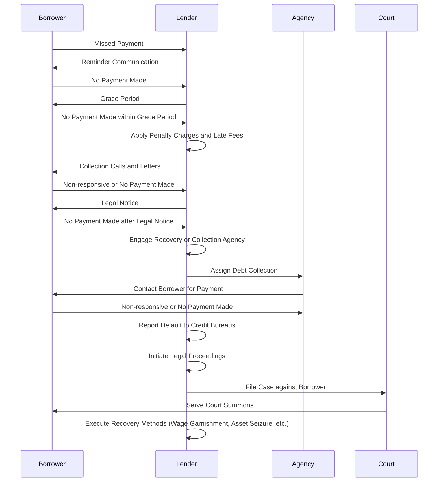

# A Generic Workflow for a Decentralized Credit Application

Any credit application consists of the following interactions. Bear in mind, this is just an example workflow for a simple transaction between a Lender and a Borrower. The order of interactions between the two parties is arbitratrily selected on the basis of several interviews with subject matter experts.

A typical workflow for a loan application consits of the following steps

#### Step 1: Borrower researches and selects a lender
The borrower researches various lenders to find the most suitable options for a personal loan. They compare interest rates, loan terms, eligibility criteria, and customer reviews to make an informed decision.

#### Step 12: Borrower submits a loan application
The borrower fills out an application form provided by the chosen lender.
The application form typically requires personal details such as name, address, contact information, employment details, income, and other relevant information.

#### Step 3: Lender reviews the loan application
The lender reviews the loan application submitted by the borrower.
They assess the borrower's eligibility based on factors such as credit score, income stability, employment history, and existing financial obligations.

#### Step 4: Lender requests additional documentation
If the initial application meets the lender's requirements, they may request additional documentation to verify the borrower's information.
Commonly requested documents include identity proof, address proof, income proof (salary slips, bank statements, income tax returns), employment proof, and any other specific documents mentioned by the lender.

#### Step 5: Lender evaluates the documents
The lender examines the submitted documents to verify the borrower's details.
They verify the authenticity of the documents and cross-check the information provided in the application form.

#### Step 6: Lender assesses the creditworthiness
Based on the borrower's credit history, income, and other relevant factors, the lender determines the borrower's creditworthiness.
They evaluate the borrower's ability to repay the loan by considering their debt-to-income ratio, credit score, and other financial aspects.

#### Step 7: Lender approves or rejects the loan application
After assessing the borrower's creditworthiness, the lender makes a decision on approving or rejecting the loan application.
If approved, the lender communicates the loan amount, interest rate, tenure, and other terms and conditions to the borrower.

#### Step 8: Borrower accepts the loan offer
If the loan application is approved, the borrower reviews the loan offer provided by the lender.
They carefully read and understand the terms and conditions, interest rate, repayment schedule, and any associated fees or charges.
If satisfied, the borrower accepts the loan offer by signing the loan agreement.

#### Step 9: Lender disburses the loan amount
Upon receiving the borrower's acceptance, the lender initiates the loan disbursal process.
They transfer the approved loan amount to the borrower's designated bank account.

#### Step 10: Borrower starts repaying the loan
Once the loan amount is disbursed, the borrower starts making repayments as per the agreed-upon .
They can typically repay the loan through equated monthly instalments (EMIs) via post-dated checks, automatic bank transfers, or online payment methods.

#### Step 11: Lender monitors loan repayments
The lender keeps track of the borrower's repayments throughout the loan tenure.
They send periodic statements showing the loan balance, EMI due dates, and any other relevant information.

#### Step 12: Borrower completes loan repayment
The borrower continues repaying the loan as per the agreed schedule until the entire loan amount, along with the applicable interest, is repaid.
Once the loan is fully repaid, the borrower receives a loan closure confirmation from the lender.

According to beckn protocol, any consumer-provider interaction can be broken down into four stages namely, Discovery, Ordering, Fulfillment and Post-Fulfillment. Without loss of generality, let us break the above credit application process into the four stages and describe the subinteractions that occur within them.

## Discovery (Discovering Loan Products)
In this stage, many interactions can happen like,

1. Borrower declares their Intent to one or more Lenders
2. Lender Publishes their Catalog of Loan products

### Borrower-side Actions
A Borrower can declare their intent in many ways like
- Searching for a lender, (say, a bank) by its name or code
- Searching for lenders based on rating
- Searching for loan products by its name / code
- Searching for loan products by its category name / code
- Searching for loan products by loan amount
- Viewing the catalog of loan products of the lender
- Viewing the details of a Lender
- Viewing the details of a particular loan product

### Lender-side Actions
In this interaction, the Lender publishes their catalog of products. A Lender can publish various types of catalogs like,
- Catalog of Loan Products
- Catalog of Loan Product Categories
- Catalog of Lenders
- Catalog containing details of a single vendor
- Catalog of a Lender containing details of a single Loan Product

### Logical Workflow

### Beckn Protocol API Workflow
In beckn protocol, the search intent generated by the Borrower Platform (BAP) is typically published on the gateway (BG) that broadcasts the intent to multiple lender platforms (BPPs). Each of the BPPs return their catalogs directly to the BAP via asynchronous callbacks. The workflow for that is shown below.

## Ordering (Loan Application Stage)
Applying for a loan consists of multiple interactions like,

### Borrower-side actions
1. Selecting lender(s)
2. Submitting a Know your Customer (KYC) form
3. Sharing financial information like Bank Statements, Invoicing Data, etc
4. Signing the Loan Agreement

### Lender-side actions
1. Requesting for financial information
2. Requesting KYC details
3. Making a loan offer
4. Creating the loan agreement

### Logical Workflow

The below diagram illustrates the logical interactions between a borrower and a lender during the Loan Application stage. 

### Beckn Protocol API Workflow

## Fulfillment (Sanction and Disbursal Stage)

In this stage, the loan application has been submitted successfully. During this stage, the borrower or the lender can perform actions like

1. Status updates regarding confirmation, disbursal, repayment etc
2. Termination of a loan application
3. Updating the terms of a loan agreement
4. Requesting additional information

These actions can be initiated at the borrower's end as well as the lender's end.

### Borrower side actions
The borrower can perform the following actions after a loan has been applied

1. Requesting for a status update on the loan application
2. Request to terminate a loan agreement
3. Request to update specific details in the loan application

### Lender-side actions

1. Providing updates on the status of the loan application, disbursal, repayment etc
2. Terminating a loan agreement
3. Updating the terms of a loan agreement or other details

### Logical Workflow

#### Request for status update (with unsolicited status updates from lender's side)

#### Requesting termination of a loan agreement

#### Unsolicited trmination of a loan agreement from lender's side

> **Note**: The lender and the borrower boxes are exchanged due to limitations in the mermaid UML plugin. This limitation only allows sequence diagrams to start from left to right. 

#### Requesting update of a loan agreement

#### Uncolicited update of a loan agreement from the lender's side

> **Note**: The lender and the borrower boxes are exchanged due to limitations in the mermaid UML plugin. This limitation only allows sequence diagrams to start from left to right. 

## Post-Fulfillment (Repayment Stage)

This stage contains everything that happens after the sanction and disbursal of a loan like,

1. Repayment of loans
2. Defaults
3. Rating
4. Support

### Repayment of the Loan

After the loan is sanctioned and funds are disbursed, the borrower begins the loan repayment phase. This involves making regular payments (EMI) according to the agreed-upon repayment schedule outlined in the loan agreement. The borrower typically repays the loan through monthly instalments that include both the principal amount and the interest. This repayment is done via existing payment infrastrucutures like Netbanking, Payment Gateways, Cheque Deposits, and in some supported regions like India - UPI.

Beckn protocol does not support payment transactions in its API and relies on existing payment infrastructures to facilitate payments. However, the terms of repayment like the EMI amount, frequency of EMI, bank account details etc are exchanged via beckn protocol APIs. Once an EMI payment is made, it is recommended that the lender send a status update regarding the receipt of payment and an updated order containing the balance amount.

### Pre-payment of a Loan
Sometimes the borrower pre-pays a loan or its EMI before its due date. The typical workflow is illustrated here.

#### Step 1: Notify the Lender
The borrower notifies the lender of their intention to make a prepayment.
This notification can be made through various channels such as phone call, email, or in-person visit, as specified by the lender.

#### Step 2: Obtain Prepayment Quotation
The lender provides the borrower with a prepayment quotation.
The quotation includes the exact amount to be paid for prepayment, considering any applicable fees or charges.

#### Step 3: Initiate Prepayment
The borrower initiates the prepayment process by transferring the agreed-upon amount to the lender.
This transfer can be made through electronic funds transfer, online payment, or any other method specified by the lender.

#### Step 4: Update Loan Account
The lender updates the borrower's loan account to reflect the prepayment.
They record the prepayment amount and adjust the outstanding loan balance accordingly.

#### Step 5: Provide Confirmation
The lender provides confirmation to the borrower regarding the successful prepayment.

#### Step 6: Update Repayment Schedule
If applicable, the lender updates the borrower's repayment schedule based on the prepayment made.
They adjust the remaining EMIs (Equated Monthly Instalments) or revise the loan tenure, considering the reduced outstanding balance.

The illustrated diagram of the above workflow is shown here

### Loan Defaults

The below workflow is usually initiated when the borrower fails to make the scheduled repayment. Bear in mind, this is just an example workflow and can change basis the loan type, region, and amount. 

### Step 1: Missed Payment
The borrower fails to make the scheduled payment for their personal loan on the due date.

### Step 2: Reminder Communication
The lender initiates contact with the borrower through various means such as phone calls, emails, or SMS.
They remind the borrower about the missed payment and request immediate payment.

### Step 3: Penalty Charges and Late Fees
If the borrower fails to make the payment within the due date, the lender applies penalty charges and late fees as per the terms and conditions of the loan agreement.
These additional charges are added to the outstanding amount.

### Step 4: Grace Period
Some lenders may provide a grace period during which the borrower can make the overdue payment without being labeled as a defaulter.
The duration of the grace period varies depending on the lender's policies.

### Step 5: Collection Calls and Letters
The lender escalates the collection efforts by making repeated phone calls to the borrower and sending written notices or collection letters.
These communications highlight the consequences of non-payment and urge the borrower to settle the outstanding amount.

### Step 6: Legal Notice
If the borrower still does not respond or make the required payment, the lender may send a legal notice to the borrower.
The legal notice informs the borrower of the intention to take legal action if the debt remains unpaid.

### Step 7: Recovery or Collection Agency
In certain cases, the lender may engage a third-party recovery or collection agency to assist in recovering the outstanding amount.
The agency may contact the borrower through phone calls, letters, or personal visits to enforce payment.

### Step 8: Credit Score Impact
The borrower's non-payment and default are reported to credit bureaus, which negatively impact their credit score.
A lower credit score makes it difficult for the borrower to secure future loans and may also affect their eligibility for other financial services.

### Step 9: Potential legal Proceedings
If all attempts to recover the outstanding amount fail, the lender may initiate legal proceedings against the borrower.

The illustration of a loan default workflow is shown below.

