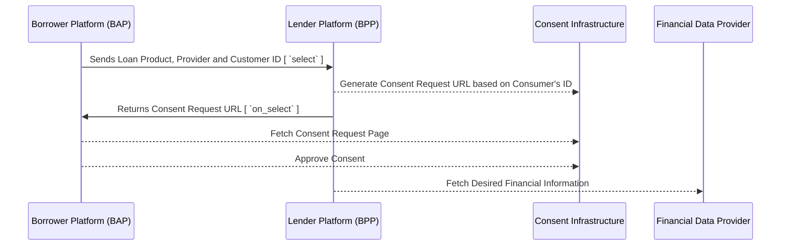

# Invoice based Loans Workflow

The Invoice-based workflow uses the same workflow as the consent-based workflow with the difference only in the consent request. In this flow, the lender simple requests the borrower's consent to pull transaction details from their business accounts.

The following steps outline the flow of Loan Application using beckn protocol with electronically consented data sharing for Invoice based loans

## Loan Product Discovery

### Searching for loan products

To discover a loan product on a beckn-enabled network, the BAP must fire a `search` request to the BG containing atleast one the following fields

1. Loan Category
2. Loan Product
3. Loan Amount requested

#### An example `search` request containing the name of a loan category is shown below

```
{
  "context": {
    "domain": "financial-services:0.2.0",
    "location": {
      "country": {
        "code": "IND"
      }
    },
    "transaction_id": "a9aaecca-10b7-4d19-b640-b047a7c62196",
    "message_id": "bb579fb8-cb82-4824-be12-fcbc405b6608",
    "action": "search",
    "timestamp": "2023-05-25T05:23:03.443Z",
    "version": "1.1.0",
    "bap_uri": "https://credit-protocol-network.becknprotocol.io/",
    "bap_id": "credit-protocol.becknprotocol.io",
    "ttl": "PT10M"
  },
  "message": {
    "intent": {
      "category": {
        "descriptor": {
          "name": "Invoice based loan"
        }
      }
    }
  }
}
```
> **Note:** If the loan categories are standardized at a network level, then the `message.intent.category.descriptor.name` may be replaced with `message.intent.category.descriptor.code` containing the standardized code of the loan category.

#### Example `search` Request for a Loan Product based on Loan Product Name and Loan Amount

```
{
    "context": {
        "domain": "financial-services:0.2.0",
        "location": {
            "country": {
                "code": "IND"
            }
        },
        "transaction_id": "a9aaecca-10b7-4d19-b640-b047a7c62196",
        "message_id": "bb579fb8-cb82-4824-be12-fcbc405b6608",
        "action": "search",
        "timestamp": "2023-05-25T05:23:03.443Z",
        "version": "1.1.0",
        "bap_uri": "https://credit-protocol-network.becknprotocol.io/",
        "bap_id": "credit-protocol.becknprotocol.io",
        "ttl": "PT10M"
    },
    "message": {
        "intent": {
            "item": {
                "descriptor": {
                    "name": "Invoice based loan"
                },
                "price": {
                    "value": "200000",
                    "currency": "INR"
                }
            }
        }
    }
}
```

### Returning a catalog of loan products

#### An example `on_search` callback containing a catalog of loan products offered by a single lender

```
{
  "context": {
    "domain": "financial-services:0.2.0",
    "location": {
      "country": {
        "code": "IND"
      }
    },
    "version": "1.1.0",
    "action": "on_search",
    "bap_id": "credit-protocol.becknprotocol.io",
    "bap_uri": "https://credit-protocol-network.becknprotocol.io/",
    "transaction_id": "a9aaecca-10b7-4d19-b640-b047a7c62196",
    "message_id": "bb579fb8-cb82-4824-be12-fcbc405b6608",
    "ttl": "PT30M",
    "timestamp": "2023-05-25T05:23:03.443Z",
    "bpp_id": "bpp.credit.icicibank.io",
    "bpp_uri": "https://bpp.credit.icicibank.io"
  },
  "message": {
    "catalog": {
      "descriptor": {
        "name": "ICICI Bank"
      },
      "providers": [
        {
          "id": "1",
          "descriptor": {
            "images": [
              {
                "url": "https://www.icicibank.com/content/dam/icicibank/india/assets/images/header/logo.png"
              }
            ],
            "code": "ICICIBANK",
            "name": "ICICI Bank",
            "short_desc": "ICICI Bank Ltd",
            "long_desc": "ICICI Bank Ltd, India."
          },
          "categories": [
            {
              "id": "102661",
              "descriptor": {
                "name": "Invoice based loan"
              }
            }
          ],
          "items": [
            {
              "id": "66b7b9bad166-4a3f-ada6-ca063dc9d321",
              "descriptor": {
                "name": "Invoice based Loan"
              },
              "tags": [
                {
                  "descriptor": {
                    "name": "General Information"
                  },
                  "list": [
                    {
                      "descriptor": {
                        "name": "Interest Rate",
                        "short_desc": "Rate of Interest (p.a)"
                      },
                      "value": "12%"
                    }
                  ],
                  "display": true
                }
              ],
              "matched": true
            }
          ]
        }
      ]
    }
  }
}
```

> **Note:** In modern lending flows, these interactions happen at the BAP's backend resulting in a pre-populated interface on the borrower's UI. Borrower applications may collect a majority of the user's information during signup and perform a scan across the network containing various lender platforms and their loan products. These loan products may appear as a pre-sorted static list on the borrower's app. However, this flow is not a mandatory. consumer applications with simpler UI's may default to a simple text-based search resulting in a dynamic catalog of search results obtained asynchronously from multiple lending platforms on the network 


## Loan Application

### Selection of a Loan Product (`select`)

The BAP sends the loan product, the loan provider, and the customer's identity to the BPP. In a consent-based data sharing use case, the customer's identity should be able to generate a consent request. For example, In India, the consent request is generated by sharing the Account Aggregator ID, ex: 9999999999@onemoney.

```
{
  "context": {
    "domain": "financial-services:0.2.0",
    "location": {
      "country": {
        "code": "IND"
      }
    },
    "transaction_id": "a9aaecca-10b7-4d19-b640-b047a7c62196",
    "message_id": "$bb579fb8-cb82-4824-be12-fcbc405b6608",
    "action": "select",
    "timestamp": "2023-05-25T05:23:03.443Z",
    "version": "1.1.0",
    "bap_uri": "https://credit-protocol-network.becknprotocol.io/",
    "bap_id": "credit-protocol.becknprotocol.io",
    "ttl": "PT10M",
    "bpp_id": "bpp.credit.icicibank.io",
    "bpp_uri": "https://bpp.credit.icicibank.io"
  },
  "message": {
    "order": {
      "provider": {
        "id": "1"
      },
      "items": [
        {
          "id": "66b7b9bad166-4a3f-ada6-ca063dc9d321"
        }
      ],
      "fulfillments": [
        {
          "customer": {
            "id": "9999999999@onemoney"
          }
        }
      ]
    }
  }
}

```

### Returning a consent request with additional details about the loan product (`on_select`)

In this interaction, the Lender Platform (BPP) generates a consent request, and an XInput form may expect other details pertaining to the borrower's business like Tax ID. Company registration address, Ownership Details etc, depending on the type of loan. 

```
{
  "context": {
      "domain": "financial-services:0.2.0",
      "location": {
          "country": {
              "code": "IND"
          }
      },
      "action": "on_select",
      "version": "1.1.0",
      "bap_id": "credit-protocol.becknprotocol.io",
      "bap_uri": "https://credit-protocol-network.becknprotocol.io/",
      "bpp_id": "bpp.credit.icicibank.io",
      "bpp_uri": "https://bpp.credit.icicibank.io",
      "transaction_id": "a9aaecca-10b7-4d19-b640-b047a7c62195",
      "message_id": "c8e3968c-cd78-4e46-aa34-0d541e46bd73",
      "timestamp": "2023-05-25T05:23:03.443Z",
      "ttl": "P30M"
  },
  "message": {
      "order": {
          "provider": {
              "id": "1",
              "descriptor": {
                  "images": [
                      {
                          "url": "https://www.icicibank.com/content/dam/icicibank/india/assets/images/header/logo.png"
                      }
                  ],
                  "code": "ICICIBANK",
                  "name": "ICICI Bank",
                  "short_desc": "ICICI Bank Ltd",
                  "long_desc": "ICICI Bank Ltd, India."
              }
          },
          "items": [
              {
                  "id": "66b7b9bad166-4a3f-ada6-ca063dc9d321",
                  "descriptor": {
                      "name": "Invoice based loan",
                      "short_desc": "Invoice based loan of INR 2 Lakhs at price INR 2,45,000"
                  },
                  "price" : {
                      "value": "245000",
                      "currency": "INR"
                  }
              }
          ],
          "type": "DEFAULT",
          "tags": [
              {
                  "descriptor": {
                      "code": "consent_request"
                  },
                  "list": [
                      {
                          "descriptor": {
                              "code": "consent_url"
                          },
                          "value": "https://fiu-uat.setu.co/consents/webview/c8f6e545-4627-4e4e-b47f-e8b11f299fb7"
                      }
                  ],
                  "display": false
              }
          ],
          "xinput": {
              "form": {
                  "mime_type": "text/html",
                  "url": "https://6vs8xnx5i7.icicibank.co.in/loans/xinput/formid/a23f2fdfbbb8ac402bf259d75"
              },
              "required": true
          }
      }
  }
}
```
Below is an example `XInput` form used to collect additional data from the customer.

```


```

> **Note:** Some of these fields like Organization name etc may already have been provided by the BAP during the `select` call inside the `Customer` object. In case the BPP already has this information, it can a) prepopulate the values for these fields, b) Not send these fields as an input requirement. In other cases, the BPP might simply generate a consent request against the customer's ID to share financial information or profile information with the BPP. 

### Consented Data Sharing

The BAP shares the borrower's ID with the lenders. The lenders use this ID to create a consent request url to access the borrower's account statement. Upon receiving the consent url, the BAP redirects the borrower to the consent page. In case the BAP has an SDK that is capable of processing the consent request, it can render the consent form natively in the app. In other cases, the BAP can simply redirect the user to the consent page on the device's web browser. Alternatively, the BAP can render the web page inside a WebView on its app. On this page, the borrower can review and approve or reject the consent.

In the case of credit, the borrower typically gives consent to the lender to pull their financial records, or any other profile information and assess the borrower's credit-worthiness. After the borrower approves the consent, the lender can retrieve the borrower's bank account statement via the appropriate APIs of the consent infrastructure.

The consent-based data sharing flow is illustrated in the diagram below.



### Submission of Additional Information and requesting for offer (`init`)

Here the BAP submits the additional information that was requested by the BPP in the `XInput` form. 

```
{
  "context": {
    "domain": "financial-services:0.2.0",
    "location": {
      "country": {
        "code": "IND"
      }
    },
    "version": "1.1.0",
    "action": "init",
    "bap_uri": "https://credit-protocol-network.becknprotocol.io/",
    "bap_id": "credit-protocol.becknprotocol.io",
    "bpp_id": "bpp.credit.icicibank.io",
    "bpp_uri": "https://bpp.credit.icicibank.io",
    "transaction_id": "a9aaecca-10b7-4d19-b640-b047a7c62196",
    "message_id": "0d30bfbf-87b8-43d2-8f95-36ebb9a24fd6",
    "ttl": "PT10M",
    "timestamp": "2023-05-25T05:23:03.443Z"
  },
  "message": {
    "order": {
      "provider": {
        "id": "1"
      },
      "items": [
        {
          "id": "66b7b9bad166-4a3f-ada6-ca063dc9d321"
        }
      ],
      "fulfillments": [
        {
          "customer": {
            "id": "9999999999@onemoney"
          }
        }
      ],
      "xinput": {
        "form": {
          "mime_type": "text/html",
          "data": {
            "GSTIN": "ABCDS1234E",
            "udyamNumber": "UDYAM-HR-1234567",
            "mobile": "+91987654321",
            "requestedLoanAmount": "INR 2,00,000"
            "address": "Alpha Manufacturing, Hebbal SEZ, Industrial Park, Bangalore-560045"
          }
        }
      }
    }
  }
}
```

Now the lender has all the information to make an offer to the borrower. 

### Lender makes an offer with repayment terms (`on_init`)

```
{
  "context": {
    "domain": "financial-services:0.2.0",
    "location": {
      "country": {
        "code": "IND"
      }
    },
    "version": "1.1.0",
    "action": "on_init",
    "bap_uri": "https://credit-protocol-network.becknprotocol.io/",
    "bap_id": "credit-protocol.becknprotocol.io",
    "bpp_id": "bpp.credit.icicibank.io",
    "bpp_uri": "https://bpp.credit.icicibank.io",
    "transaction_id": "a9aaecca-10b7-4d19-b640-b047a7c62196",
    "message_id": "166a5633-66d2-4ec8-bdcb-65cfeb1e4697",
    "ttl": "PT10M",
    "timestamp": "2023-05-25T05:23:03.443Z"
  },
  "message": {
    "order": {
      "provider": {
        "id": "1",
        "descriptor": {
          "images": [
            {
              "url": "https://www.icicibank.com/content/dam/icicibank/india/assets/images/header/logo.png"
            }
          ],
          "code": "ICICIBANK",
          "name": "ICICI Bank",
          "short_desc": "ICICI Bank Ltd",
          "long_desc": "ICICI Bank Ltd, India."
        }
      },
      "items": [
        {
          "id": "66b7b9bad166-4a3f-ada6-ca063dc9d321",
          "descriptor": {
            "name": "Loan Offer : INR 2,00,000"
          },
          "price": {
            "currency": "INR",
            "value": "230000"
          },
          "tags": [
            {
              "descriptor": {
                "name": "Invoice based loan terms"
              },
              "list": [
                {
                  "descriptor": {
                    "name": "Interest Rate",
                    "short_desc": "Rate of Interest (p.a)"
                  },
                  "value": "12%"
                },
                {
                  "descriptor": {
                    "name": "Interest Type",
                    "short_desc": "Type of Interest Rate"
                  },
                  "value": "FLOATING"
                },
                {
                  "descriptor": {
                    "name": "Term",
                    "short_desc": "Max Loan Term"
                  },
                  "value": "5 months"
                },
                {
                  "descriptor": {
                    "name": "Foreclosure Penalty",
                    "short_desc": "Loan Foreclosure Penalty"
                  },
                  "value": "0.5%"
                },
                {
                  "descriptor": {
                    "name": "Delayed payments penalty",
                    "short_desc": "Delayed payments penalty"
                  },
                  "value": "5%"
                },
                {
                  "descriptor": {
                    "name": "Terms & Conditions",
                    "short_desc": "Terms and Conditions"
                  },
                  "value": "https://icicibank.com/loan/tnc.html"
                }
              ],
              "display": true
            }
          ]
        }
      ],
      "quote": {
        "price": {
          "currency": "INR",
          "value": "231800"
        },
        "breakup": [
          {
            "title": "Principal",
            "price": {
              "value": "200000",
              "currency": "INR"
            }
          },
          {
            "title": "Interest",
            "price": {
              "value": "30000",
              "currency": "INR"
            }
          },
          {
            "title": "Processing fee",
            "price": {
              "value": "1800",
              "currency": "INR"
            }
          }
        ]
      },
      "payments": [
        {
          "type": "ON-ORDER",
          "url": "https://emandate.icicibank.in",
          "params": {
            "amount": "46360",
            "currency": "INR"
          },
          "status": "NOT-PAID",
          "time": {
            "range": {
              "start": "01-06-2023 00:00:00",
              "end": "30-06-2023 23:59:59"
            }
          }
        },
        {
          "params": {
            "amount": "46360",
            "currency": "INR"
          },
          "status": "NOT-PAID",
          "time": {
            "range": {
              "start": "01-07-2023 00:00:00",
              "end": "31-07-2023 23:59:59"
            }
          }
        },
        {
          "params": {
            "amount": "46360",
            "currency": "INR"
          },
          "status": "NOT-PAID",
          "time": {
            "range": {
              "start": "01-08-2023 00:00:00",
              "end": "31-08-2023 23:59:59"
            }
          }
        },
        {
          "params": {
            "amount": "46360",
            "currency": "INR"
          },
          "status": "NOT-PAID",
          "time": {
            "range": {
              "start": "01-09-2023 00:00:00",
              "end": "30-09-2023 23:59:59"
            }
          }
        },
        {
          "params": {
            "amount": "46360",
            "currency": "INR"
          },
          "status": "NOT-PAID",
          "time": {
            "range": {
              "start": "01-10-2023 00:00:00",
              "end": "31-10-2023 23:59:59"
            }
          }
        }
      ],
      "cancellation_terms": [
        {
          "fulfillment_state": {
            "descriptor": {
              "name": "Loan sanctioned"
            }
          },
          "cancellation_fee": {
            "percentage": "3%"
          },
          "external_ref": {
            "mimetype": "text/html",
            "url": "https://icicibank.com/loan/tnc.html"
          }
        },
        {
          "fulfillment_state": {
            "descriptor": {
              "name": "Loan disbursed"
            }
          },
          "cancellation_fee": {
            "percentage": "5%"
          },
          "external_ref": {
            "mimetype": "text/html",
            "url": "https://icicibank.com/loan/tnc.html"
          }
        }
      ],
      "tags": [
        {
          "list": [
            {
              "descriptor": {
                "name": "KYC Request",
                "short_desc": "Click on this link to submit your KYC Details"
              },
              "value": "https://dg-sandbox.setu.co/okyc/initiate/95e3d7ae-45fa-47f5-8a7a-55f4dc20fd7f/"
            },
            {
              "descriptor": {
                "name": "Loan Agreement",
                "short_desc": "Click on this link to view and sign your Loan Agreement"
              },
              "value": "https://icicibank.com/loanAgreement?id=afyrq9fbH"
            }
          ]
        }
      ]
    }
  }
}
```

### Borrower Confirms Loan and Authorizes Lender to Disburse Loan (`confirm`)

```
{
    "context": {
        "domain": "financial-services:0.2.0",
        "location": {
            "country": {
                "code": "IND"
            }
        },
        "transaction_id": "a9aaecca-10b7-4d19-b640-b047a7c62196",
        "message_id": "$bb579fb8-cb82-4824-be12-fcbc405b6608",
        "action": "confirm",
        "timestamp": "2023-05-25T05:23:03.443Z",
        "version": "1.1.0",
        "bap_uri": "https://credit-protocol-network.becknprotocol.io/",
        "bap_id": "credit-protocol.becknprotocol.io",
        "bpp_id": "bpp.credit.icicibank.io",
        "bpp_uri": "https://bpp.credit.icicibank.io",
        "ttl": "PT10M"
    },
    "message": {
        "order": {
            "provider": {
                "id": "1"
            },
            "items": [
                {
                    "id": "66b7b9bad166-4a3f-ada6-ca063dc9d321"
                }
            ],
            "fulfillments": [
                {
                    "stops": [
                        {
                            "type": "start",
                            "authorization": {
                                "type": "OTP",
                                "token": "143532"
                            }
                        }
                    ]
                }
            ],
            "payments": [
                {
                    "params": {
                        "source_bank_code": "SBIN0001234",
                        "source_bank_account_number": "1800002341"
                    }
                }
            ]
        }
    }
}
```
### Lender confirms loan application and sanctions loan

```
{
  "context": {
    "domain": "financial-services:0.2.0",
    "location": {
      "country": {
        "code": "IND"
      }
    },
    "version": "1.1.0",
    "action": "on_confirm",
    "bap_uri": "https://credit-protocol-network.becknprotocol.io/",
    "bap_id": "credit-protocol.becknprotocol.io",
    "bpp_id": "bpp.credit.icicibank.io",
    "bpp_uri": "https://bpp.credit.icicibank.io",
    "transaction_id": "a9aaecca-10b7-4d19-b640-b047a7c62196",
    "message_id": "0d30bfbf-87b8-43d2-8f95-36ebb9a24fd6",
    "ttl": "PT10M",
    "timestamp": "2023-05-25T05:23:03.443Z"
  },
  "message": {
    "order": {
      "id": "66B7AEDF45",
      "provider": {
        "id": "1",
        "descriptor": {
          "images": [
            {
              "url": "https://www.icicibank.com/content/dam/icicibank/india/assets/images/header/logo.png"
            }
          ],
          "code": "ICICIBANK",
          "name": "ICICI Bank",
          "short_desc": "ICICI Bank Ltd",
          "long_desc": "ICICI Bank Ltd, India."
        }
      },
      "items": [
        {
          "id": "66b7b9bad166-4a3f-ada6-ca063dc9d321",
          "descriptor": {
            "name": "Loan Offer : INR 2,00,000"
          },
          "price": {
            "currency": "INR",
            "value": "230000"
          },
          "tags": [
            {
              "descriptor": {
                "name": "Invoice based loan terms"
              },
              "list": [
                {
                  "descriptor": {
                    "name": "Interest Rate",
                    "short_desc": "Rate of Interest (p.a)"
                  },
                  "value": "12%"
                },
                {
                  "descriptor": {
                    "name": "Interest Type",
                    "short_desc": "Type of Interest Rate"
                  },
                  "value": "FLOATING"
                },
                {
                  "descriptor": {
                    "name": "Term",
                    "short_desc": "Max Loan Term"
                  },
                  "value": "5 months"
                },
                {
                  "descriptor": {
                    "name": "Foreclosure Penalty",
                    "short_desc": "Loan Foreclosure Penalty"
                  },
                  "value": "0.5%"
                },
                {
                  "descriptor": {
                    "name": "Delayed payments penalty",
                    "short_desc": "Delayed payments penalty"
                  },
                  "value": "5%"
                },
                {
                  "descriptor": {
                    "name": "Terms & Conditions",
                    "short_desc": "Terms and Conditions"
                  },
                  "value": "https://icicibank.com/loan/tnc.html"
                }
              ],
              "display": true
            }
          ]
        }
      ],
      "quote": {
        "price": {
          "currency": "INR",
          "value": "231800"
        },
        "breakup": [
          {
            "title": "Principal",
            "price": {
              "value": "200000",
              "currency": "INR"
            }
          },
          {
            "title": "Interest",
            "price": {
              "value": "30000",
              "currency": "INR"
            }
          },
          {
            "title": "Processing fee",
            "price": {
              "value": "1800",
              "currency": "INR"
            }
          }
        ]
      },
      "fulfillments": [
        {
          "customer": {
            "organization": {
              "address": "Industrial Park, Bangalore",
              "state": {
                "name": "Karnataka"
              },
              "city": {
                "name": "Bangalore",
                "code": "560045"
              },
              "contact": {
                "phone": "+919876543210",
                "email": "alpha.manufacturing@gmail.com"
              }
            }
          },
          "state": {
            "descriptor": {
              "name": "Loan Sanctioned"
            }
          }
        }
      ],
      "payments": [
        {
          "type": "ON-ORDER",
          "url": "https://emandate.icicibank.in",
          "params": {
            "amount": "46360",
            "currency": "INR"
          },
          "status": "NOT-PAID",
          "time": {
            "range": {
              "start": "01-06-2023 00:00:00",
              "end": "30-06-2023 23:59:59"
            }
          }
        },
        {
          "params": {
            "amount": "46360",
            "currency": "INR"
          },
          "status": "NOT-PAID",
          "time": {
            "range": {
              "start": "01-07-2023 00:00:00",
              "end": "31-07-2023 23:59:59"
            }
          }
        },
        {
          "params": {
            "amount": "46360",
            "currency": "INR"
          },
          "status": "NOT-PAID",
          "time": {
            "range": {
              "start": "01-08-2023 00:00:00",
              "end": "31-08-2023 23:59:59"
            }
          }
        },
        {
          "params": {
            "amount": "46360",
            "currency": "INR"
          },
          "status": "NOT-PAID",
          "time": {
            "range": {
              "start": "01-09-2023 00:00:00",
              "end": "30-09-2023 23:59:59"
            }
          }
        },
        {
          "params": {
            "amount": "46360",
            "currency": "INR"
          },
          "status": "NOT-PAID",
          "time": {
            "range": {
              "start": "01-10-2023 00:00:00",
              "end": "31-10-2023 23:59:59"
            }
          }
        }
      ],
      "cancellation_terms": [
        {
          "fulfillment_state": {
            "descriptor": {
              "name": "Loan sanctioned"
            }
          },
          "cancellation_fee": {
            "percentage": "3%"
          },
          "external_ref": {
            "mimetype": "text/html",
            "url": "https://icicibank.com/loan/tnc.html"
          }
        },
        {
          "fulfillment_state": {
            "descriptor": {
              "name": "Loan disbursed"
            }
          },
          "cancellation_fee": {
            "percentage": "5%"
          },
          "external_ref": {
            "mimetype": "text/html",
            "url": "https://icicibank.com/loan/tnc.html"
          }
        }
      ]
    }
  }
}
```


## Loan Disbursal

### Lender disburses loan

In this stage the lender deposits the loan amount in the borrower's bank account through existing payment infrastructures.

### Lender provides status update regarding loan disbursal

```
{
    "context": {
        ...
        "action": "on_status"
    },
    "message": {
        "order": {
            ...
            "fulfillments": [
                {
                    ...
                    "state": {
                        "descriptor": {
                            "name": "Loan Disbursed"
                        }
                    }
                }
            ]
        }
    }
}
```
## Loan Repayment ( Post-Fulfillment )

### Lender provides status update regarding EMI Received

```
{
    "context": {
        ...
        "action": "on_status"
    },
    "message": {
        "order": {
            ...
            "fulfillments": [
                {
                    ...
                    "state": {
                        "descriptor": {
                            "name": "Installment 1/5 received"
                        }
                    }
                }
            ],
            "payments": [
                {
                    "type": "ON-ORDER",
                    "url": "https://emandate.icicibank.in",
                    "params": {
                        "amount": "46360",
                        "currency": "INR"
                    },
                    "status": "PAID",
                    "time": {
                        "range": {
                            "start": "01-06-2023 00:00:00",
                            "end": "30-06-2023 23:59:59"
                        }
                    }
                },
                ...
            ]
        }
    }
}
```