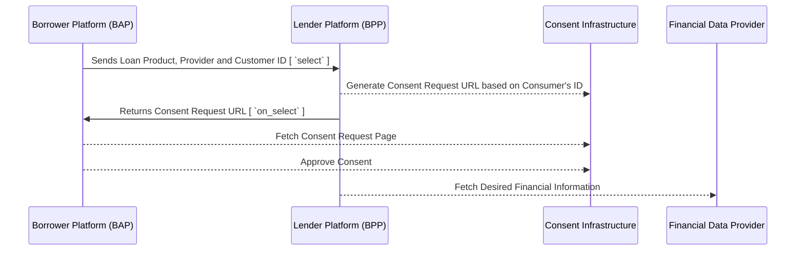

# Personal Loan Workflow (Using Electronically Consented Data Sharing)

The following steps outline the flow of Personal Loan Application using beckn protocol

## Loan Product Discovery

### Searching for personal loan products

To discover a loan product on a beckn-enabled network, the BAP must fire a `search` request to the BG containing atleast one the following fields

1. Loan Category
2. Loan Product
3. Loan Amount requested

#### An example `search` request containing the name of a loan category is shown below

```
{
    "context": {
        "domain": "financial-services:0.2.0",
        "location": {
            "country": {
                "code": "IND"
            }
        },
        "transaction_id": "a9aaecca-10b7-4d19-b640-b047a7c62196",
        "message_id": "bb579fb8-cb82-4824-be12-fcbc405b6608",
        "action": "search",
        "timestamp": "2023-05-25T05:23:03.443Z",
        "version": "1.1.0",
        "bap_uri": "https://credit-protocol-network.becknprotocol.io/",
        "bap_id": "credit-protocol.becknprotocol.io",
        "ttl": "PT10M"
    },
    "message": {
        "intent": {
            "category": {
                "descriptor": {
                    "name": "Personal loan"
                }
            }
        }
    }
}
```
> **Note:** If the loan categories are standardized at a network level, then the `message.intent.category.descriptor.name` may be replaced with `message.intent.category.descriptor.code` containing the standardized code of the loan category.

#### Example `search` Request for a Loan Product based on Loan Product Name and Loan Amount

```
{
    "context": {
        "domain": "financial-services:0.2.0",
        "location": {
            "country": {
                "code": "IND"
            }
        },
        "transaction_id": "a9aaecca-10b7-4d19-b640-b047a7c62196",
        "message_id": "bb579fb8-cb82-4824-be12-fcbc405b6608",
        "action": "search",
        "timestamp": "2023-05-25T05:23:03.443Z",
        "version": "1.1.0",
        "bap_uri": "https://credit-protocol-network.becknprotocol.io/",
        "bap_id": "credit-protocol.becknprotocol.io",
        "ttl": "PT10M"
    },
    "message": {
        "intent": {
            "item": {
                "descriptor": {
                    "name": "Personal loan"
                },
                "price": {
                    "value": "200000",
                    "currency": "INR"
                }
            }
        }
    }
}
```

### Returning a catalog of loan products

#### An example `on_search` callback containing a catalog of loan products offered by a single lender

```
{
    "context": {
        "domain": "financial-services:0.2.0",
        "location": {
            "country": {
                "code": "IND"
            }
        },
        "version": "1.1.0",
        "action": "on_search",
        "bap_id": "credit-protocol.becknprotocol.io",
        "bap_uri": "https://credit-protocol-network.becknprotocol.io/",
        "transaction_id": "a9aaecca-10b7-4d19-b640-b047a7c62196",
        "message_id": "bb579fb8-cb82-4824-be12-fcbc405b6608",
        "ttl": "PT30M",
        "timestamp": "2023-05-25T05:23:03.443Z",
        "bpp_id": "bpp.credit.icicibank.io",
        "bpp_uri": "https://bpp.credit.icicibank.io"
    },
    "message": {
        "catalog": {
            "descriptor": {
                "name": "ICICI Bank"
            },
            "providers": [
                {
                    "id": "1",
                    "descriptor": {
                        "images": [
                            {
                                "url": "https://www.icicibank.com/content/dam/icicibank/india/assets/images/header/logo.png"
                            }
                        ],
                        "code": "ICICIBANK",
                        "name": "ICICI Bank",
                        "short_desc": "ICICI Bank Ltd",
                        "long_desc": "ICICI Bank Ltd, India."
                    },
                    "categories": [
                        {
                            "id": "101123",
                            "descriptor": {
                                "name": "Personal loan"
                            }
                        }
                    ],
                    "items": [
                        {
                            "id": "66b7b9bad166-4a3f-ada6-ca063dc9d321",
                            "descriptor": {
                                "name": "Personal Loan"
                            },
                            "tags": [
                                {
                                    "descriptor": {
                                        "name": "General Information"
                                    },
                                    "list": [
                                        {
                                            "descriptor": {
                                                "name": "Interest Rate",
                                                "short_desc": "Rate of Interest (p.a)"
                                            },
                                            "value": "12%"
                                        }
                                    ],
                                    "display": true
                                }
                            ],
                            "matched": true
                        },
                        {
                            "id": "c8e3968c-cd78-4e46-aa34-0d541e46bd73",
                            "descriptor": {
                                "name": "Car Loan"
                            },
                            "tags": [
                                {
                                    "descriptor": {
                                        "name": "General Information"
                                    },
                                    "list": [
                                        {
                                            "descriptor": {
                                                "name": "Interest Rate",
                                                "short_desc": "Rate of Interest (p.a)"
                                            },
                                            "value": "8.5%"
                                        }
                                    ],
                                    "display": true
                                }
                            ],
                            "matched": false
                        },
                        {
                            "id": "80414936-a06d-49ae-9475-f99448c77014",
                            "descriptor": {
                                "name": "Education Loan"
                            },
                            "tags": [
                                {
                                    "descriptor": {
                                        "name": "General Information"
                                    },
                                    "list": [
                                        {
                                            "descriptor": {
                                                "name": "Interest Rate",
                                                "short_desc": "Rate of Interest (p.a)"
                                            },
                                            "value": "13%"
                                        }
                                    ],
                                    "display": true
                                }
                            ],
                            "matched": false
                        }
                    ]
                }
            ]
        }
    }
}
```


> **Note:** In modern lending flows, these interactions happen at the BAP's backend resulting in a pre-populated interface on the borrower's UI. Borrower applications may collect a majority of the user's information during signup and perform a scan across the network containing various lender platforms and their loan products. These loan products may appear as a pre-sorted static list on the borrower's app. However, this flow is not a mandatory. consumer applications with simpler UI's may default to a simple text-based search resulting in a dynamic catalog of search results obtained asynchronously from multiple lending platforms on the network 


## Loan Application

### Selection of a Loan Product

The BAP sends the loan product, the loan provider, and the customer's identity to the BPP. In a consent-based data sharing use case, the customer's identity should be able to generate a consent request. For example, In India, the consent request is generated by sharing the Account Aggregator ID, ex: 9999999999@onemoney. 

```
{
    "context": {
        "domain": "financial-services:0.2.0",
        "location": {
            "country": {
                "code": "IND"
            }
        },
        "transaction_id": "a9aaecca-10b7-4d19-b640-b047a7c62196",
        "message_id": "$bb579fb8-cb82-4824-be12-fcbc405b6608",
        "action": "select",
        "timestamp": "2023-05-25T05:23:03.443Z",
        "version": "1.1.0",
        "bap_uri": "https://credit-protocol-network.becknprotocol.io/",
        "bap_id": "credit-protocol.becknprotocol.io",
        "ttl": "PT10M",
        "bpp_id": "bpp.credit.icicibank.io",
        "bpp_uri": "https://bpp.credit.icicibank.io"
    },
    "message": {
        "order": {
            "provider": {
                "id": "1"
            },
            "items": [
                {
                    "id": "66b7b9bad166-4a3f-ada6-ca063dc9d321"
                }
            ],
            "fulfillments": [
                {
                    "customer": {
                        "id": "9999999999@onemoney"
                    }
                }
            ]
        }
    }
}
```

### Returning a consent request with additional details about the loan product

In this interaction, the Lender Platform (BPP) generates a consent request, and an `XInput` object to collect additional details about the borrower like borrower's name, address, date of birth, PAN (Permanent Account Number), phone number, income, employment type, and company name.

```
{
    "context": {
        "domain": "financial-services:0.2.0",
        "location": {
            "country": {
                "code": "IND"
            }
        },
        "action": "on_select",
        "version": "1.1.0",
        "bap_id": "credit-protocol.becknprotocol.io",
        "bap_uri": "https://credit-protocol-network.becknprotocol.io/",
        "bpp_id": "bpp.credit.icicibank.io",
        "bpp_uri": "https://bpp.credit.icicibank.io",
        "transaction_id": "a9aaecca-10b7-4d19-b640-b047a7c62195",
        "message_id": "c8e3968c-cd78-4e46-aa34-0d541e46bd73",
        "timestamp": "2023-05-25T05:23:03.443Z",
        "ttl": "P30M"
    },
    "message": {
        "order": {
            "provider": {
                "id": "1",
                "descriptor": {
                    "images": [
                        {
                            "url": "https://www.icicibank.com/content/dam/icicibank/india/assets/images/header/logo.png"
                        }
                    ],
                    "code": "ICICIBANK",
                    "name": "ICICI Bank",
                    "short_desc": "ICICI Bank Ltd",
                    "long_desc": "ICICI Bank Ltd, India."
                }
            },
            "items": [
                {
                    "id": "66b7b9bad166-4a3f-ada6-ca063dc9d321",
                    "descriptor": {
                        "name": "Personal Loan",
                        "short_desc": "Personal Loan of INR 2,00,000 at price INR 2,45,000"
                    }
                }
            ],
            "type": "DEFAULT",
            "tags": [
                {
                    "descriptor": {
                        "code": "consent_request"
                    },
                    "list": [
                        {
                            "descriptor": {
                                "code": "consent_url"
                            },
                            "value": "https://fiu-uat.setu.co/consents/webview/c8f6e545-4627-4e4e-b47f-e8b11f299fb7"
                        }
                    ],
                    "display": false
                }
            ],
            "xinput": {
                "form": {
                    "mime_type": "text/html",
                    "url": "https://6vs8xnx5i7.icicibank.co.in/loans/xinput/formid/a23f2fdfbbb8ac402bf259d75"
                },
                "required": "true"
            }
        }
    }
}
```
Below is an example `XInput` form used to collect additional data from the customer.

```
   <form>
     <label for="firstName">First Name</label>
     <input type="text" id="firstName" name="firstName" />
     <label for="lastName">Last Name</label>
     <input type="text" id="lastName" name="lastName" />
     <label for="dob">Date of Birth</label>
     <input type="date" id="dob" name="dob" />
     <label for="sex">Sex</label>
     <select name="sex" id="sex">
       <option value="male">Male</option>
       <option value="female">Female</option>
     </select>
     <label for="maritalStatus">Marital Status</label>
     <select name="maritalStatus" id="maritalStatus">
       <option value="single">Single</option>
       <option value="married">Married</option>
     </select>
     <label for="address">Address</label>
     <input type="text" id="address" name="address" />
     <label for="idType">Identity Type</label>
     <select name="idType" id="idType">
       <option value="pan">PAN</option>
       <option value="aadhaar">Aadhaar</option>
     </select>
     <label for="idValue">ID Number</label>
     <input type="text" id="idValue" name="idValue" />
     <label for="incomeProofType">Income Proof Type</label>
     <select name="incomeProofType" id="incomeProofType">
       <option value="salary_slip">Salary Slip</option>
       <option value="income_tax_return">Income Tax Return</option>
     </select>
     <label for="incomeProof">Upload the Income Proof</label>
     <input name="incomeProof" type="file" />
   </form>
```

> **Note:** Some of these fields like Name, Date of Birth, Sex, Address etc may already have been provided by the BAP during the `select` call inside the `Customer` object. In case the BPP already has this information, it can a) prepopulate the values for these fields, b) Not send these fields as an input requirement. In other cases, the BPP might simply generate a consent request against the customer's ID to share financial information or profile information with the BPP. 


### Consented Data Sharing

The BAP shares the borrower's ID with the lenders. The lenders use this ID to create a consent request url to access the borrower's account statement. Upon receiving the consent url, the BAP redirects the borrower to the consent page. In case the BAP has an SDK that is capable of processing the consent request, it can render the consent form natively in the app. In other cases, the BAP can simply redirect the user to the consent page on the device's web browser. Alternatively, the BAP can render the web page inside a WebView on its app. On this page, the borrower can review and approve or reject the consent.

In the case of credit, the borrower typically gives consent to the lender to pull their financial records, or any other profile information and assess the borrower's credit-worthiness. After the borrower approves the consent, the lender can retrieve the borrower's bank account statement via the appropriate APIs of the consent infrastructure.

The consent-based data sharing flow is illustrated in the diagram below.



### 

Step 3: Loan Offers
Depending on the borrower's credit history and account statement, the lenders either return pre-approved offers to the borrower or do not provide offers based on their underwriting criteria. 
The borrower can then choose to proceed with one of the offers or request an offer with a lower amount. If the borrower selects a lower amount, the lenders will share a revised offer..

Step 4: KYC
The lender orchestrates the KYC process by sharing a KYC link with the borrower. The borrower is redirected to the KYC URL, where they enter their KYC document details and may optionally share a one-time password to complete the KYC.

Step 5: Repayment setup 
Upon successful completion of KYC, the lender requests the borrower's disbursement account details and asks them to set up repayment using eNACH, eMandate, or standing instructions.

Step 6: Loan agreement sign and disbursal
The lender shares the complete loan agreement with the borrower through the Buyer app. The borrower is requested to enter the OTP (One-Time Password) provided by the lender to complete the eSigning process. 
Alternatively, the lender can provide a link to the loan agreement, allowing the borrower to review the agreement and proceed with Aadhar eSign. 
After signing the agreement, the lender may request account monitoring access on the borrower's account. Finally, the lender disburses the loan amount.

