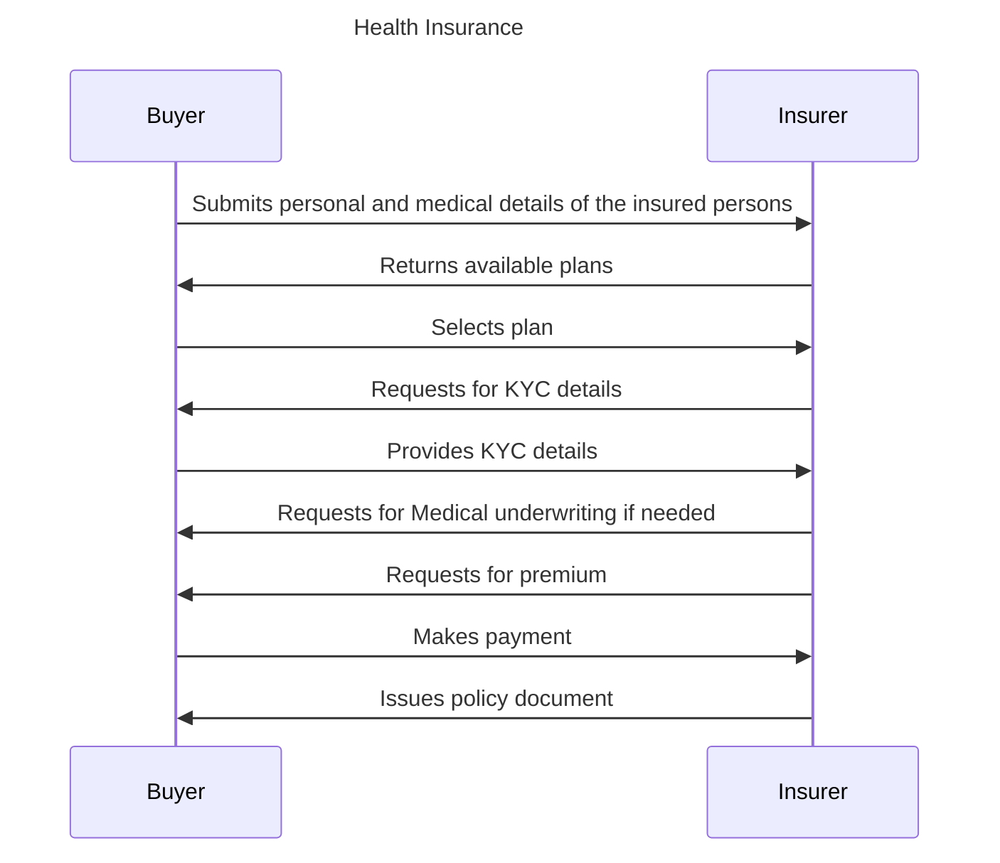
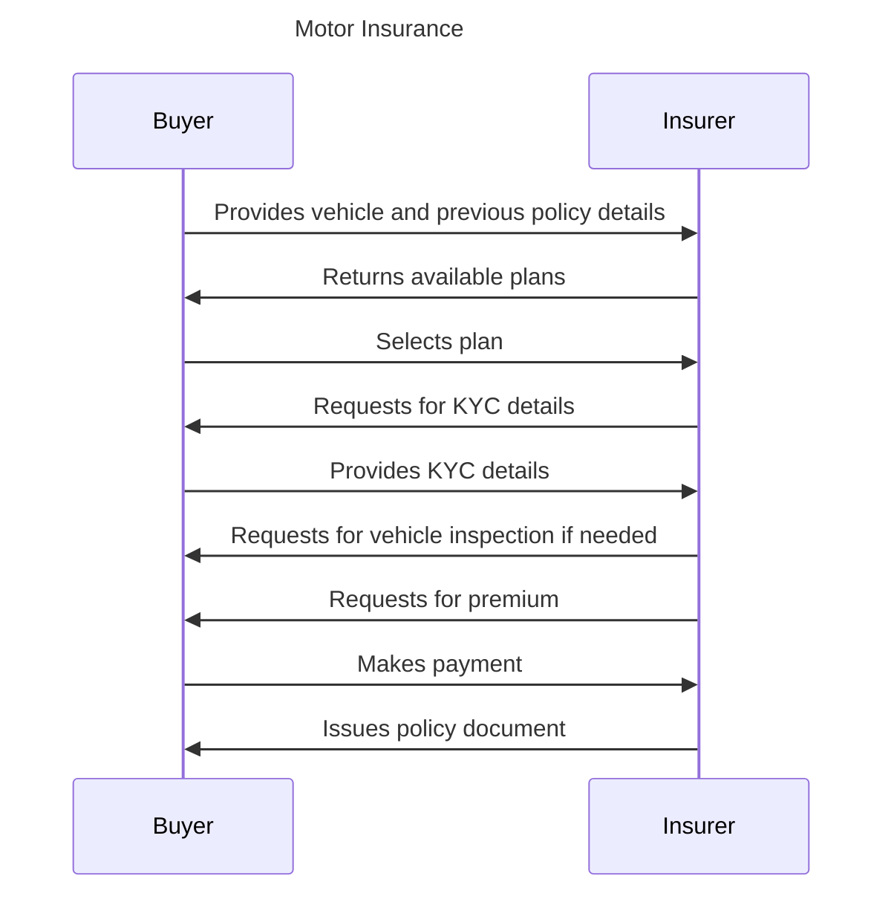
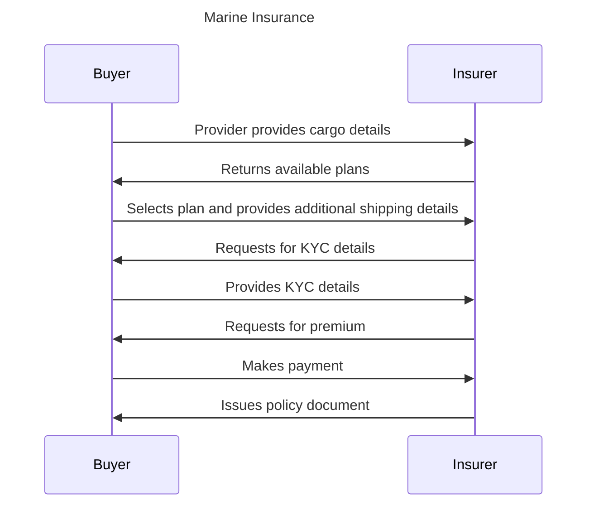

## Insurance Use Cases

### Table of Contents

- [Introduction](#introduction)
- [Insurance Types](#insurance-types)
- [Use Cases considered](#use-cases-considered)
- [Out of Scope](#out-of-scope)
- [Generic Insurance Workflow](#generic-insurance-workflow)
  - [Health Insurance](#health-insurance)
  - [Motor Insurance](#motor-insurance)
  - [Marine Insurance](#marine-insurance)
- [Discovery](#discovery)
- [Insurance processing and renewal (Ordering & Fulfilment)](#insurance-processing-and-approval-ordering--fulfilment)
- [Policy Renewal and Cancellation (Post-fulfillment)](#policy-renewal-and-cancellation-post-fulfillment)
  - [Policy Renewal](#policy-renewal)
  - [Policy Cancellation](#policy-cancellation)

### Introduction

The insurance industry plays a crucial role in society, offering essential protection to individuals and businesses against unexpected risks. The fundamental idea behind insurance is for the insurer to provide assurance of payment in the face of an unpredictable future event. Simultaneously, the insured or policyholder pays a smaller premium to the insurer in return for safeguarding against that uncertain future incident. The insurance sector provides a wide range of options, such as life, health, property, and motor insurance, ensuring financial security during difficult times. Factors like growing incomes, increased awareness, and government support contribute to the sector's robust growth. Regulatory bodies in different countries diligently oversee the sector, ensuring transparency and protecting consumer interests. By fostering economic stability and empowering businesses to operate confidently, insurance plays a crucial role in society's well-being.

### Insurance Types

**Life Insurance:** Life insurance policies provide financial protection to the policyholder's family in the event of the insured's demise. It helps secure the future of the beneficiaries by offering a lump sum or periodic payouts, ensuring financial stability during difficult times.

**Health Insurance:** Health insurance plans cover medical expenses incurred by the insured due to illnesses, hospitalization, surgeries, and other medical treatments. It ensures access to quality healthcare without burdening individuals with high medical costs.

**Motor Insurance:** Motor insurance includes both two-wheeler insurance and car insurance. It provides coverage against damages to the vehicle and offers liability protection for third-party injuries or property damage caused by accidents.

**Home Insurance:** Home insurance policies safeguard homeowners against damages to their properties caused by perils like fire, theft, natural calamities, and other specified risks. It offers financial security for one's most valuable asset.

**Travel Insurance:** Travel insurance protects individuals during domestic and international trips against trip cancellations, medical emergencies, baggage loss, and travel-related issues. It ensures a worry-free travel experience.

**Personal Accident Insurance:** Personal accident insurance provides coverage in case of accidental death, permanent disability, or temporary disablement due to accidents. It offers financial support to the insured or their family during unexpected incidents.

**Marine Insurance:** Marine insurance covers goods, cargo, and vessels during transportation by sea or air. It provides financial protection against damages or losses incurred during transit.

Crop Insurance:\*\* Crop insurance aims to protect farmers against crop losses due to natural calamities, pests, or diseases. It supports the agricultural community by providing financial assistance during adverse crop conditions.

Cyber Insurance:\*\* Cyber insurance protects individuals and businesses from financial losses resulting from cyberattacks, data breaches, and online threats. It helps mitigate the impact of cyber incidents on businesses and personal data.

### Use Cases considered

- Health insurance
- Motor Insurance
- Marine Insurance

### Out of Scope

- Porting health policy
- STP Claim process

### Generic Insurance Workflow

#### Health Insurance

**Step 1: Research and Compare Health Insurance Plans**

- Buyer researches various health insurance plans available in the market and compares different insurers, plan types, coverage options, premiums, and benefits.

**Step 2: Choose a Suitable Health Insurance Plan**

- Based on the research and needs assessment, the buyer selects the most appropriate health insurance plan that best matches their requirements.

**Step 3: Submit required information**

- Buyer provides personal information, medical history, and any other details requested by the insurer.

**Step 5: Declaration of Pre-existing Conditions**

- Buyer discloses any pre-existing medical conditions as required by the insurer.

**Step 6: Document submission and KYC**

- The buyer submits documents necessary for the insurance application, such as identification proof, address proof, and any additional documents required for KYC verification.
- The insurance company verifies the authenticity of the submitted documents to comply with regulatory requirements

**Step 8: Medical Underwriting (if applicable)**

- In some cases, the insurance company may request a medical examination or review the insurers’ medical records to assess risk.
- The insurer evaluates the information to determine the premium and coverage terms.

**Step 9: Pay the Premium**

- Pay the premium amount specified by the insurance company.
- Buyer chooses a payment frequency that suits them, such as monthly, quarterly, semi-annually, or annually.

**Step 10: Receive the Policy Document**

- Once the application, KYC verification, and premium payment are processed, the insurance company issues the health insurance policy.
- The policy document contains all the terms, conditions, coverage details, and buyers’ rights and responsibilities as a policyholder.

#### Motor Insurance

**Step 1: Research Different Motor Insurance Options**

- Research various motor insurance policies available in the market.
  Compare different insurers, coverage options, premiums, and benefits.

**Step 2: Assess Vehicle's Insurance Needs**

- The Insurer evaluates vehicle's make, model, age, and usage to determine the appropriate coverage.
- Consider factors such as third-party liability, own damage, personal accident cover, etc.

**Step 3: Choose the Type of Motor Insurance Policy**

- Buyer decides whether they need a third-party liability policy or a comprehensive insurance policy that covers both third-party liability and own damage.

**Step 4: Submit Required Information**

- The buyer submits required information for the insurance application, including vehicle registration details, and previous policy details.

**Step 5: Undergo Vehicle Inspection (if applicable)**

- Some insurers may require a physical inspection of your vehicle before issuing the policy.
- Schedule an inspection with the insurer's representative, if needed.

**Step 6: Choose Additional Add-ons (if required)**

- Consider optional add-ons like zero depreciation cover, roadside assistance, engine protection, etc.
- Choose add-ons that enhance the coverage based on your needs.

**Step 7: Pay the Premium**

- Pay the premium amount specified by the insurance company.
- Select the payment frequency that suits you, such as yearly, half-yearly, quarterly, or monthly.

**Step 8: Receive the Policy Document**

- Once the application and premium payment are processed, the insurance company issues the motor insurance policy to you.
- The policy document contains all the terms, conditions, coverage details, and your rights and responsibilities as a policyholder.

#### Marine Insurance

**Step 1: Research Marine/Transit Insurance Options**

- Buyer researches various marine and transit insurance policies available in the market.
  Compare different insurers, coverage options, premiums, and benefits.

**Step 2: Choose the Type of Marine/Transit Insurance**

- Buyer selects the type of marine/transit insurance they need.

**Step 3: Submit Required Information**

- Buyer submits the required information to the insurer for the insurance application, such as the invoice, packing list, bill of lading, and any other relevant shipping documents.
- Buyer provides transportation details, and the insured value.

**Step 4: Document submission and KYC**

- The buyer submits documents necessary for the insurance application, such as identification proof, address proof, and any additional documents required for KYC verification.
- The insurance company verifies the authenticity of the submitted documents to comply with regulatory requirements

**Step 5: Pay the Premium**

- Buyer pays the premium amount specified by the insurance company.

**Step 6: Receive the Policy Document**

- Once the premium payment is processed, the insurance company issues the marine/transit insurance policy to the buyer..
- The policy document contains all the terms, conditions, coverage details, the buyer’s rights and responsibilities as a policyholder.

### Discovery

**Step 1: Identify the Type of Insurance**

- Based on their needs, the buyer identifies the type of insurance product that best aligns with their purpose, such as health insurance, life insurance, motor insurance, home insurance, etc.

**Step 2: Research Reputable Insurers**

- The buyer conducts thorough research to find reputable insurance providers in the market. They look for well-established insurance companies with a track record of prompt claim settlement and excellent customer service.

**Step 3: Utilise Online Comparison Platforms**

- Buyers take advantage of online comparison websites or aggregator platforms that specialize in comparing insurance policies. These platforms allow the buyer to input their insurance needs and view multiple insurers' offerings, including coverage details, premiums, and policy features side by side.

**Step 4: Visit Insurer Websites**

- Buyers visit the official websites of potential insurers to gather more information about their insurance products. They pay attention to coverage options, exclusions, premium rates, and any additional benefits or riders available.

### Insurance processing and approval (Ordering & Fulfilment)

**Step 1: Documentation Submission**

- The buyer submits necessary documents to the insurance company for verification. These documents include proof of identity, address, medical reports (for health insurance), and any other required documents.

**Step 2: Insurance Application Processing**

- The insurer reviews and verifies the submitted documents, conducts a risk assessment, and evaluates the buyer's insurability. Once the application is approved, the insurer prepares the insurance policy document, detailing the coverage, premium, and policy terms.

**Step 3: Policy Acceptance and Premium Payment**

- The buyer accepts the insurance offer, agrees to the policy terms, and pays the insurance premium.

**Step 4: Policy Issuance and Coverage Commencement**

- After receiving the premium payment, the insurance company issues the policy, and the insurance coverage begins.

### Policy Renewal and Cancellation (Post-fulfillment)

#### Policy Renewal

**Step 1: Premium Payment**

- If the policyholder decides to renew the policy, they make the premium payment before the expiration date. Some insurers offer grace periods for late payments.

**Step 2: Policy Renewal**

- Upon receiving the premium payment, the insurance company renews the policy for the specified duration, extending the coverage under the existing terms and conditions.

**Step 3: Updated Policy Document**

- The insurer provides an updated policy document to the policyholder, confirming the renewal and outlining any changes or updates to the coverage.

#### Policy Cancellation

**Step 1: Premium Payment**

- If the policyholder decides to renew the policy, they make the premium payment before the expiration date. Some insurers offer grace periods for late payments.

**Step 2: Policy Renewal**

- Upon receiving the premium payment, the insurance company renews the policy for the specified duration, extending the coverage under the existing terms and conditions.

**Step 3: Updated Policy Document**

- The insurer provides an updated policy document to the policyholder, confirming the renewal and outlining any changes or updates to the coverage.
