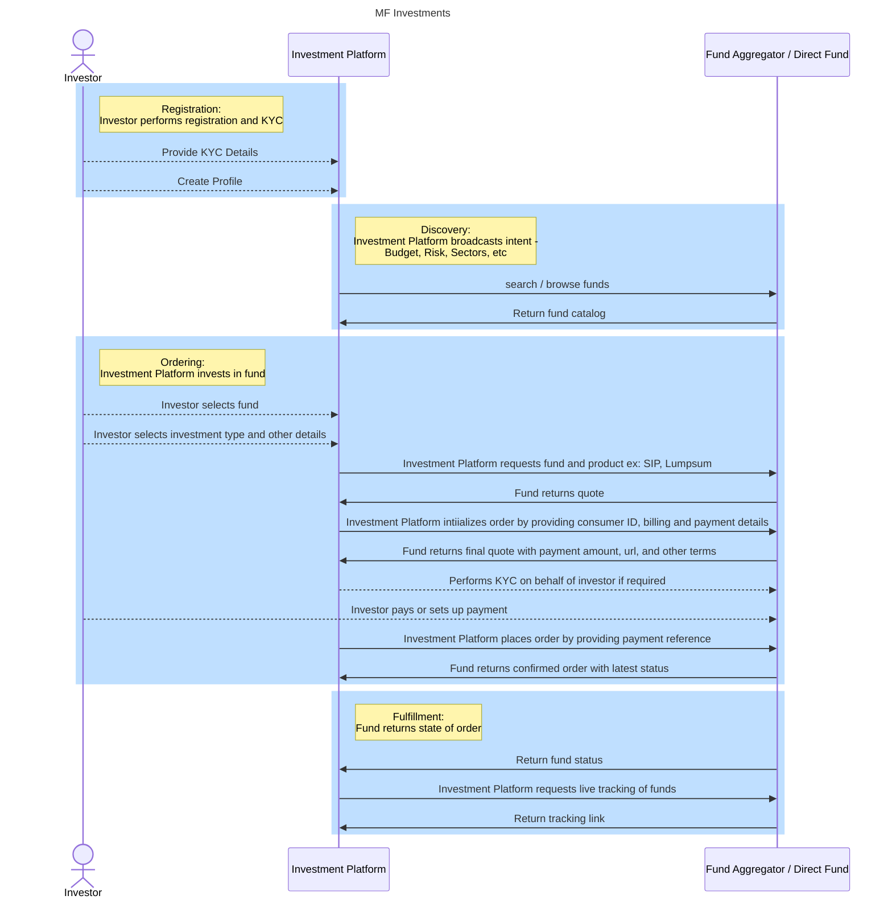

# Mutual Funds Investment - Implementation Guide

## Table of contents

- [Introduction](#introduction)
- [Investment Types](#investment-types)
- [Use Cases Considered](#use-cases-considered)
- [Out of Scope](#use-cases-considered)
- [Generic Mutual Funds Investments Workflow](#generic-mutual-funds-investments-workflow)

## Introduction

Mutual funds serve as an accessible and efficient way for individual investors to participate in the financial markets, achieve diversification, and work toward their financial objectives with the help of professional management.

### Key benefits for individual investors

1. **Diversification:** Mutual funds offer access to a diversified portfolio of assets, reducing risk by spreading investments across various securities and industries.
2. **Professional Management:** With expert fund managers handling investment decisions, investors can benefit from their knowledge and experience, saving time and effort in researching individual investments.
3. **Affordability:** Mutual funds allow individuals to invest with a relatively low amount, enabling them to participate in the financial markets with a smaller initial investment.
4. **Liquidity:** Mutual funds provide liquidity, allowing investors to buy or sell shares at the fund's current NAV price on any business day, providing easy access to their money.
5. **Flexibility:** Various mutual funds cater to different risk profiles and investment objectives, providing options for investors with varying financial goals.
6. **Transparency:** Fund companies must disclose their holdings regularly, providing transparency to investors about the underlying assets.
7. **Regulatory Oversight:** Mutual funds are subject to regulatory supervision, providing a level of protection to investors and ensuring compliance with rules and regulations.
8. **Long-Term Growth Potential:** Mutual funds can offer the potential for long-term capital appreciation and steady income, making them a popular choice for retirement planning and wealth creation.
9. **Tax Benefits:** Some mutual funds offer tax advantages, such as tax-free or tax-deferred growth, depending on the fund type and the investor's tax jurisdiction.

### Investment Types

1. Mutual Fund Investments
2. Direct Equity Investments
3. Gold investments
4. Direct bonds investments
5. Alternative Investments

## Use Cases Considered:

### In Scope

- Mutual Funds Investments with real-time order placement using a broker or an Asset Management Company
- Investor Profile: Single Account Owner

### Out of Scope:

- Corporate/ Treasury Investments
- Multiple owner investment Accounts
- Investment in Private Equity, Hedge Funds, etc

## Example Mutual Funds Network

## Mutual Funds Investments Example Workflows

## Registration

In this workflow. the Investment Platform signs up the customer on the platform and creates their profile and preferences. This workflow is not mandatory, but implementing this will enable the Investment platform to recommend smart investment strategies to its user. Maintaining an updated customer profile allows the investment platform to continuously scan the network for recommended funds to invest in therefore enabling maximum profitability for the investor.  

Most funds or fund aggregators today are centralized platforms that maintain their own customer database and hence require the customer to perform KYC before investing in a fund, therefore maintaining the investor's KYC details and other preferences allow investment platforms to automate the submission of the KYC form. 

**Note:** However, in permissioned networks (for example, ONDC), each transaction is a dual-digitally signed contract between the BAP and the BPP, the BPP ideally does not need to explicitly request KYC on the customer. The network participation agreement signed by the NPs for financial services may require the BAP to mandatorily perform KYC of the investor before initiating any transaction. In such a setup, any transaction originating from a BAP can be considered to be a trusted transaction. The BPP will potentially require only a unique customer ID to create any order. In the case of ONDC, it could be the customer's PAN, Aadhaar, or any other ID, commonly accepted by the network participants. 

## Discovery

**Step 1: Research and Select MF**  
The investor views various Mutual Funds options available, researches basis key parameters such as historical returns, expense ratio, AUM etc. and decides the one (s) he/ she wants to invest.

**Step 2: Mode of investment and Amount to be invested**  
For each fund, the investor has the option to invest in lumpsum or create a SIP (periodic payment option).
The investor selects the mode of investment (lumpsum, or SIP) and the amount he/s she wants to invest.

**Step 3: Check if an investor needs KYC**  
The AMC checks if the investor has completed KYC with them in the past. If yes, there’s straight-through processing and AMC proceeds to Mutual Funds allocation process.

**Step 4: Ask KYC information**  
For investors who don’t have an active KYC, the AMC asks investors to share their identify proofs digitally and authenticate.

**Step 5: Ask Bank A/C Information**  
The AMC needs to register the customer’s bank account in order to remit investment funds as lumpsum or to create a repeat payment mandate (for SIP’s).

**Step 6: Complete customer registration**  
Post KYC completion and Bank A/C registration, the AMC creates a Customer Registration Number before completing the registration process.

**Step 7: Provide confirmation for successful registration**  
AMC shares the customer registration with the investor via email.

**Step 8: Provide MF Confirmation**  
Post successful registration, the AMC provides a digital confirmation of successful order processing to the investor clearly mentioning the Amount Invested, MF NAV to be allocated and the processing fees if any.

**Step 9: Debit Amount/ Create payment mandate**  
For Lumpsum payment, the AMC deducts the invested amount from customer’s registered bank account
For SIP payment, the AMC creates a periodic (daily, weekly, monthly) payment mandate with the registered bank account for a defined amount.

**Step 10: Allocate MF NAV**  
Post successful payment, the Mutual Fund company assigns calculated NAV against the investor’s registration number. In case, the investor opted for a SIP, the NAVs are assigned once the money is deducted successfully every time a SIP is due.

**Step 11: Provide updated NAV information**  
The AMC shares refreshed NAV information, as long as there is an active investment, with the investor on a defined periodicity.
