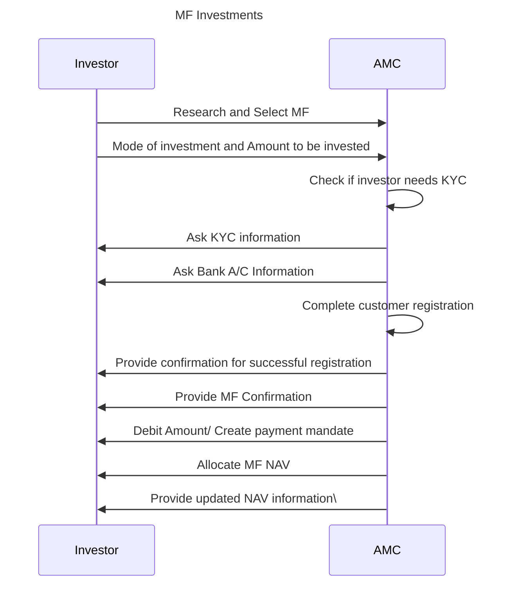

## Mutual Funds Investments

### Table of contents

- [Introduction](#introduction)
- [Terminology](#terminology)
- [Investment Types](#investment-types)
- [Use Cases Considered](#use-cases-considered)
- [Out of Scope](#use-cases-considered)
- [Generic Mutual Funds Investments Workflow](#generic-mutual-funds-investments-workflow)

### Introduction

Mutual funds serve as an accessible and efficient way for individual investors to participate in the financial markets, achieve diversification, and work toward their financial objectives with the help of professional management.

Key benefits for individual investors

1. **Diversification:** Mutual funds offer access to a diversified portfolio of assets, reducing risk by spreading investments across various securities and industries.
2. **Professional Management:** With expert fund managers handling investment decisions, investors can benefit from their knowledge and experience, saving time and effort in researching individual investments.
3. **Affordability:** Mutual funds allow individuals to invest with a relatively low amount, enabling them to participate in the financial markets with a smaller initial investment.
4. **Liquidity:** Mutual funds provide liquidity, allowing investors to buy or sell shares at the fund's current NAV price on any business day, providing easy access to their money.
5. **Flexibility:** Various mutual funds cater to different risk profiles and investment objectives, providing options for investors with varying financial goals.
6. **Transparency:** Fund companies must disclose their holdings regularly, providing transparency to investors about the underlying assets.
7. **Regulatory Oversight:** Mutual funds are subject to regulatory supervision, providing a level of protection to investors and ensuring compliance with rules and regulations.
8. **Long-Term Growth Potential:** Mutual funds can offer the potential for long-term capital appreciation and steady income, making them a popular choice for retirement planning and wealth creation.
9. **Tax Benefits:** Some mutual funds offer tax advantages, such as tax-free or tax-deferred growth, depending on the fund type and the investor's tax jurisdiction

### Terminology

**Mutual Funds (MF)**  
A mutual fund is an investment vehicle that pools money from multiple investors to create a diversified portfolio managed by professionals. Investors buy shares in the fund, providing access to various securities and benefiting from expert management

**Equity Mutual Fund**  
An equity mutual fund is a type of investment fund that primarily invests in stocks and represents ownership in a diversified portfolio of publicly-traded companies, offering the potential for capital appreciation and dividends. Investors buy shares in the fund to gain exposure to a diverse range of equities while benefiting from professional management

**Debt Mutual Fund**  
A debt mutual fund is an investment fund that primarily invests in fixed-income securities such as bonds, government securities, and money market instruments, providing investors with regular income and relatively lower risk compared to equity funds. Investors buy shares in the fund to participate in a diversified portfolio of debt securities, professionally managed to maximize returns while maintaining capital stability.

**Expense Ratio**  
The expense ratio is a measure of the annual operating expenses of a mutual fund, expressed as a percentage of its total assets, representing the fees investors pay for fund management and administration.

**AUM**  
AUM stands for "Assets Under Management" and refers to the total value of investments, including securities and other assets, that a financial institution or investment company manages on behalf of its clients or investors. It is a key metric that reflects the size and growth of a fund or investment firm's portfolio.

**SIP Investment**  
A systematic Investment Plan (SIP) is a method of investing in mutual funds, allowing investors to contribute a fixed amount regularly (daily, monthly or quarterly) over time, promoting disciplined and affordable investment while averaging the cost of investments

**Lumpsum Investment**  
Lumpsum Investment refers to a one-time investment of a significant sum of money in a financial instrument, such as mutual funds or stocks, providing an immediate exposure to the market without a regular contribution schedule

**AMC**  
An Asset Management Company (AMC) is a financial institution or company that manages and oversees investment funds, including mutual funds and other investment portfolios, on behalf of individual and institutional investors, making investment decisions and handling day-to-day operations. AMCs aim to maximize returns for investors by diversifying and actively managing the funds' assets

**KYC**  
KYC stands for "Know Your Customer" and refers to the process by which financial institutions verify and collect information about their clients' identity and financial activities to prevent money laundering, fraud, and other illegal activities.

**NAV**  
NAV stands for "Net Asset Value," and it represents the per-share value of a mutual fund or an exchange-traded fund (ETF) calculated by dividing the total value of the fund's assets minus its liabilities by the number of outstanding shares. It serves as an essential indicator of the fund's performance and is used to determine the buying and selling price of fund shares

### Investment Types

1. Mutual Fund Investments
2. Direct Equity Investments
3. Gold investments
4. Direct bonds investments
5. Alternative Investments

### Use Cases Considered:

- Mutual Funds Investments with real-time order placement with a broker or an Asset Management Company
- Investor Profile: Single Account Owner

### Out of Scope:

- Corporate/ Treasury Investments
- Multiple owner investment Accounts

### Generic Mutual Funds Investments Workflow

**Step 1: Research and Select MF**  
The investor views various Mutual Funds options available, researches basis key parameters such as historical returns, expense ratio, AUM etc. and decides the one (s) he/ she wants to invest.

**Step 2: Mode of investment and Amount to be invested**  
For each fund, the investor has the option to invest in lumpsum or create a SIP (periodic payment option).
The investor selects the mode of investment (lumpsum, or SIP) and the amount he/s she wants to invest.

**Step 3: Check if an investor needs KYC**  
The AMC checks if the investor has completed KYC with them in the past. If yes, there’s straight-through processing and AMC proceeds to Mutual Funds allocation process.

**Step 4: Ask KYC information**  
For investors who don’t have an active KYC, the AMC asks investors to share their identify proofs digitally and authenticate.

**Step 5: Ask Bank A/C Information**  
The AMC needs to register the customer’s bank account in order to remit investment funds as lumpsum or to create a repeat payment mandate (for SIP’s).

**Step 6: Complete customer registration**  
Post KYC completion and Bank A/C registration, the AMC creates a Customer Registration Number before completing the registration process.

**Step 7: Provide confirmation for successful registration**  
AMC shares the customer registration with the investor via email.

**Step 8: Provide MF Confirmation**  
Post successful registration, the AMC provides a digital confirmation of successful order processing to the investor clearly mentioning the Amount Invested, MF NAV to be allocated and the processing fees if any.

**Step 9: Debit Amount/ Create payment mandate**  
For Lumpsum payment, the AMC deducts the invested amount from customer’s registered bank account
For SIP payment, the AMC creates a periodic (daily, weekly, monthly) payment mandate with the registered bank account for a defined amount.

**Step 10: Allocate MF NAV**  
Post successful payment, the Mutual Fund company assigns calculated NAV against the investor’s registration number. In case, the investor opted for a SIP, the NAVs are assigned once the money is deducted successfully every time a SIP is due.

**Step 11: Provide updated NAV information**  
The AMC shares refreshed NAV information, as long as there is an active investment, with the investor on a defined periodicity.
