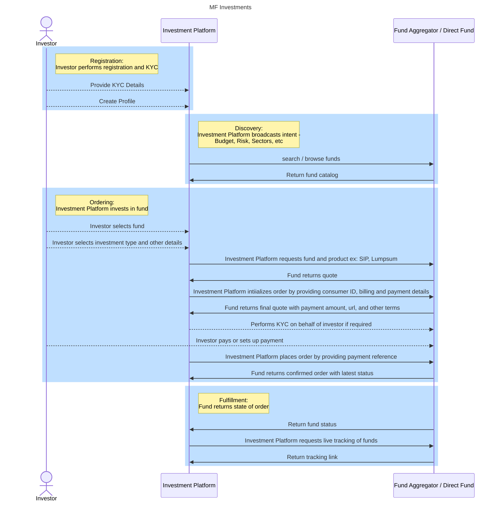
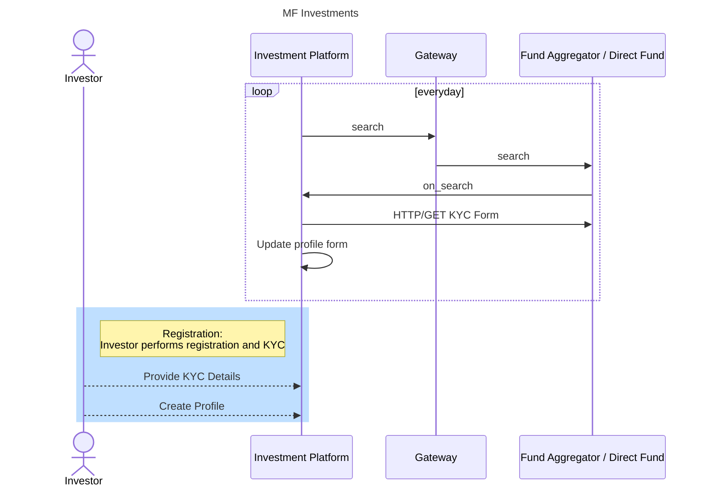
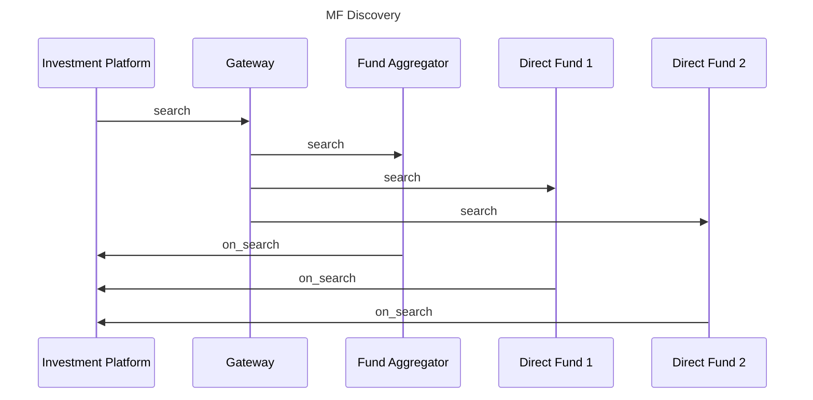
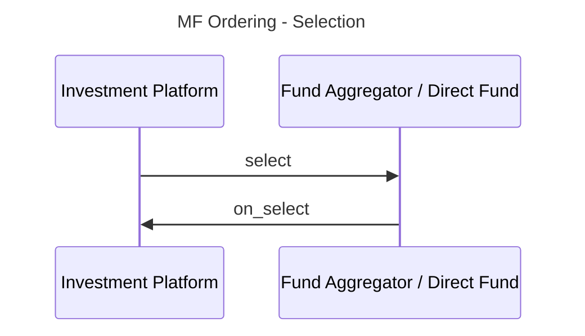
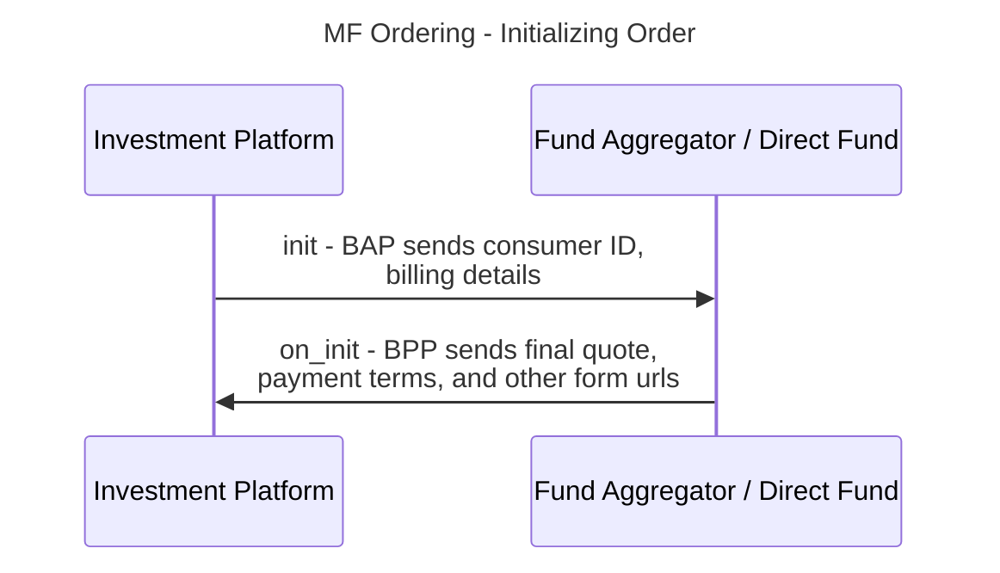
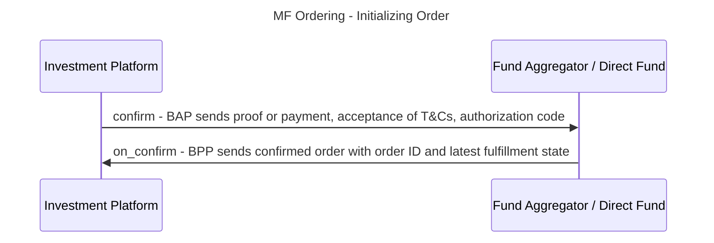

# Mutual Funds Investment - Implementation Guide

## Table of contents

- [Introduction](#introduction)
- [Investment Types](#investment-types)
- [Use Cases Considered](#use-cases-considered)
- [Out of Scope](#use-cases-considered)
- [Generic Mutual Funds Investments Workflow](#generic-mutual-funds-investments-workflow)

## Introduction

Mutual funds serve as an accessible and efficient way for individual investors to participate in the financial markets, achieve diversification, and work toward their financial objectives with the help of professional management.

### Key benefits for individual investors

1. **Diversification:** Mutual funds offer access to a diversified portfolio of assets, reducing risk by spreading investments across various securities and industries.
2. **Professional Management:** With expert fund managers handling investment decisions, investors can benefit from their knowledge and experience, saving time and effort in researching individual investments.
3. **Affordability:** Mutual funds allow individuals to invest with a relatively low amount, enabling them to participate in the financial markets with a smaller initial investment.
4. **Liquidity:** Mutual funds provide liquidity, allowing investors to buy or sell shares at the fund's current NAV price on any business day, providing easy access to their money.
5. **Flexibility:** Various mutual funds cater to different risk profiles and investment objectives, providing options for investors with varying financial goals.
6. **Transparency:** Fund companies must disclose their holdings regularly, providing transparency to investors about the underlying assets.
7. **Regulatory Oversight:** Mutual funds are subject to regulatory supervision, providing a level of protection to investors and ensuring compliance with rules and regulations.
8. **Long-Term Growth Potential:** Mutual funds can offer the potential for long-term capital appreciation and steady income, making them a popular choice for retirement planning and wealth creation.
9. **Tax Benefits:** Some mutual funds offer tax advantages, such as tax-free or tax-deferred growth, depending on the fund type and the investor's tax jurisdiction.

### Investment Types

1. Mutual Fund Investments
2. Direct Equity Investments
3. Gold investments
4. Direct bonds investments
5. Alternative Investments

## Use Cases Considered:

### In Scope

- Mutual Funds Investments with real-time order placement using a broker or an Asset Management Company
- Investor Profile: Single Account Owner

### Out of Scope:

- Corporate/ Treasury Investments
- Multiple owner investment Accounts
- Investment in Private Equity, Hedge Funds, etc

## Example Mutual Funds Network


## Mutual Funds Investments Example Workflows



## Registration

In this workflow. the Investment Platform signs up the customer on the platform and creates their profile and preferences. This workflow is not mandatory, but implementing this will enable the Investment platform to recommend smart investment strategies to its user. Maintaining an updated customer profile allows the investment platform to continuously scan the network for recommended funds to invest in therefore enabling maximum profitability for the investor.  

Most funds or fund aggregators today are centralized platforms that maintain their own customer database and hence require the customer to perform KYC before investing in a fund, therefore maintaining the investor's KYC details and other preferences allow investment platforms to automate the submission of the KYC form. 

To continously maintain updated profile information, the Investment Platform (BAP) can perform periodic scans of the network via the `search / on_search` interactions and fetch the various KYC forms of the various BPPs. The BAP can then keep its profile schema up-to-date with the latest fields and inputs required by each BPP. 

Below is an example flow of how a Investment Platform (BAP) can continuously maintain an investor's profile with respect to the KYC requirements of the Funds (BPPs)



Below is an example of how a search request looks like while scanning the network for various funds. 

```json
{
    "context": {
        "domain": "financial-services:0.2.0",
        "location": {
            "country": {
                "code": "IND"
            }
        },
        "transaction_id": "a9aaecca-10b7-4d19-b640-b047a7c62196",
        "message_id": "bb579fb8-cb82-4824-be12-fcbc405b6608",
        "action": "search",
        "timestamp": "2023-05-25T05:23:03.443Z",
        "version": "1.1.0",
        "bap_uri": "https://mutual-fund-protocol-network.becknprotocol.io/",
        "bap_id": "mutual-fund-protocol.becknprotocol.io",
        "ttl": "PT10M"
    },
    "message": {
        "intent": {
            "category": {
                "descriptor": {
                    "code": "mutual-funds"
                }
            }
        }
    }
}
```

There can be other search requests that contain the item as well such as SIP, Lumpsum etc. 

**Note:** In permissioned networks (for example, ONDC), each transaction is a dual-digitally signed contract between the BAP and the BPP, the BPP ideally does not need to explicitly request KYC on the customer. The network participation agreement signed by the NPs for financial services may require the BAP to mandatorily perform KYC of the investor before initiating any transaction. In such a setup, any transaction originating from a BAP can be considered to be a trusted transaction. The BPP will potentially require only a unique customer ID to create any order. In the case of ONDC, it could be the customer's PAN, Aadhaar, or any other ID, commonly accepted by the network participants. 

## Discovery

In this state, the BAP discovers multiple investment opportunites offered by different funds on the network by broadcasting a search intent. To do this, the BAP calls the `search` endpoint of the BG. The BG looks up the registry for platforms that offer financial service and broadcasts the search request to them. Each BPP that has catalogs that match the search intent, return their catalogs by calling the BAP's `on_search` endpoint. The BAP then aggregates the catalogs and renders the unified catalog on their BAP. Alternatively, the BAP can perform this operation in the back-end and cache the catalogs. It can further apply algorithmic recommendations on the aggregated catalog and render a more personalized experience to the investor. For example, the BAP can provide a "Top Picks of the Day" section on its app that is tailored towards the investor's preferences. 

Below is an illustration of how discovery happens on the network.



### Declaring Intent (`search`)

To perform discovery, the BAP can create various forms of search requests like shown below.

#### Search for mutual funds, i.e Search by category
In this use case, the BAP searches for all Financial Service BPPs that offer mutual funds as a category of services.
```json
{
    "context": {
        "domain": "financial-services:0.2.0",
        "location": {
            "country": {
                "code": "IND"
            }
        },
        "transaction_id": "a9aaecca-10b7-4d19-b640-b047a7c62196",
        "message_id": "bb579fb8-cb82-4824-be12-fcbc405b6608",
        "action": "search",
        "timestamp": "2023-05-25T05:23:03.443Z",
        "version": "1.1.0",
        "bap_uri": "https://mutual-fund-protocol-network.becknprotocol.io/",
        "bap_id": "mutual-fund-protocol.becknprotocol.io",
        "ttl": "PT10M"
    },
    "message": {
        "intent": {
            "category": {
                "descriptor": {
                    "code": "mutual-funds"
                }
            }
        }
    }
}
```

#### Search for Systematic Investment Plans (SIPs), i.e Search by Item
In this case, the BAP, specifies the name or code of the specific mutual fund product.

```json
{
    "context": {
        "domain": "financial-services:0.2.0",
        "location": {
            "country": {
                "code": "IND"
            }
        },
        "transaction_id": "a9aaecca-10b7-4d19-b640-b047a7c62196",
        "message_id": "bb579fb8-cb82-4824-be12-fcbc405b6608",
        "action": "search",
        "timestamp": "2023-05-25T05:23:03.443Z",
        "version": "1.1.0",
        "bap_uri": "https://mutual-fund-protocol-network.becknprotocol.io/",
        "bap_id": "mutual-fund-protocol.becknprotocol.io",
        "ttl": "PT10M"
    },
    "message": {
        "intent": {
            "category": {
                "descriptor": {
                    "code": "mutual-funds"
                }
            },
            "item": {
                "descriptor": {
                    "code": "sip"
                }
            }
        }
    }
}
```

#### Search for Mutual Fund Provider by name, i.e Search by Provider
In this case, the BAP, specifies the name or code of the specific mutual fund product.

```json
{
    "context": {
        "domain": "financial-services:0.2.0",
        "location": {
            "country": {
                "code": "IND"
            }
        },
        "transaction_id": "a9aaecca-10b7-4d19-b640-b047a7c62196",
        "message_id": "bb579fb8-cb82-4824-be12-fcbc405b6608",
        "action": "search",
        "timestamp": "2023-05-25T05:23:03.443Z",
        "version": "1.1.0",
        "bap_uri": "https://mutual-fund-protocol-network.becknprotocol.io/",
        "bap_id": "mutual-fund-protocol.becknprotocol.io",
        "ttl": "PT10M"
    },
    "message": {
        "intent": {
            "category": {
                "descriptor": {
                    "code": "mutual-funds"
                }
            },
            "provider": {
                "descriptor": {
                    "name": "Mirae Asset"
                }
            }
        }
    }
}
```
### Returning a catalog (`on_search`)
When BPPs receive a search intent, they respond with various catalogs

#### Returning a catalog of Providers and Categories
In this case, the BPP returns a catalog of providers and their categories without revealing the items. This is usually done when the search request is very vague. For example, a `search` request with only `context` and no `message.intent`. Below is an example of a provider catalog returned by Mutual Fund Utilities India, containing a list of funds.

```
{
    "context": {
        "domain": "financial-services:0.2.0",
        "location": {
            "country": {
                "code": "IND"
            }
        },
        "version": "1.1.0",
        "action": "on_search",
        "bap_id": "mutual-fund-protocol.becknprotocol.io",
        "bap_uri": "https://mutual-fund-protocol-network.becknprotocol.io/",
        "transaction_id": "a9aaecca-10b7-4d19-b640-b047a7c62196",
        "message_id": "bb579fb8-cb82-4824-be12-fcbc405b6608",
        "ttl": "PT30M",
        "timestamp": "2023-05-25T05:23:03.443Z",
        "bpp_id": "mfuindia.com",
        "bpp_uri": "https://mfuindia.com"
    },
    "message": {
        "catalog": {
            "descriptor": {
                "name": "Mutual Fund Utilities India"
            },
            "providers": [
                {
                    "id": "1",
                    "descriptor": {
                        "images": [
                            {
                                "url": "https://www.hdfcfunds.com/content/dam/abc/india/assets/images/header/logo.png",
                                "size_type": "sm"
                            }
                        ],
                        "name": "HDFC Asset Management Company",
                        "code": "hdfcfund.com",
                        "long_desc": "Discipline, good governance, and genuine care for our stakeholders have helped HDFC Asset Management Company Limited build a reputation for trust. Over the last two decades, HDFC AMC has become one of the most prominent mutual fund houses in India. We are committed to our mission of being a wealth creator for every Indian. Here is a brief snapshot of some of HDFC AMC's key milestones."
                    },
                    "rating": "4.5",
                    "tags": [
                        {
                            "descriptor": {
                                "name": "General Information",
                                "code": "general-info"
                            },
                            "list": [
                                {
                                    "descriptor": {
                                        "name": "Type"
                                    },
                                    "value": "Equity"
                                },
                                {
                                    "descriptor": {
                                        "name": "Inception Date"
                                    },
                                    "value": "2020-01-15"
                                },
                                {
                                    "descriptor": {
                                        "name": "AUM"
                                    },
                                    "value": "250,000,000"
                                }
                            ],
                            "display": true
                        }
                    ]
                },
                {
                    "id": "2",
                    "descriptor": {
                        "images": [
                            {
                                "url": "https://www.hdfcfunds.com/content/dam/abc/india/assets/images/header/logo.png",
                                "size_type": "sm"
                            }
                        ],
                        "name": "Axis Asset Management Company Limited",
                        "code": "axismf.com",
                        "long_desc": "Axis Mutual Fund launched its first scheme in October 2009. Since then Axis Mutual fund has grown strongly. We attribute our success thus far to our 3 founding principles - Long term wealth creation, Outside in (Customer) view and Long term relationship. Come join our growing family of investors and give shape to your desires."
                    },
                    "rating": "4.5",
                    "tags": [
                        {
                            "descriptor": {
                                "name": "General Information",
                                "code": "general-info"
                            },
                            "list": [
                                {
                                    "descriptor": {
                                        "name": "Type"
                                    },
                                    "value": "Equity"
                                },
                                {
                                    "descriptor": {
                                        "name": "Inception Date"
                                    },
                                    "value": "2009-10-15"
                                },
                                {
                                    "descriptor": {
                                        "name": "AUM"
                                    },
                                    "value": "250,000,000"
                                }
                            ],
                            "display": true
                        }
                    ]
                }
            ]
        }
    }
}
```

#### Returning a catalog of Providers, Categories, and Items
In this case, the BPP returns a catalog of funds and the various investment plans offered by them. This is usually returned when the search request contains `provider.id`.

```
{
    "context": {
        "domain": "financial-services:0.2.0",
        "location": {
            "country": {
                "code": "IND"
            }
        },
        "version": "1.1.0",
        "action": "on_search",
        "bap_id": "mutual-fund-protocol.becknprotocol.io",
        "bap_uri": "https://mutual-fund-protocol-network.becknprotocol.io/",
        "transaction_id": "a9aaecca-10b7-4d19-b640-b047a7c62196",
        "message_id": "bb579fb8-cb82-4824-be12-fcbc405b6608",
        "ttl": "PT30M",
        "timestamp": "2023-05-25T05:23:03.443Z",
        "bpp_id": "mfuindia.com",
        "bpp_uri": "https://mfuindia.com"
    },
    "message": {
        "catalog": {
            "descriptor": {
                "name": "Mutual Fund Utilities India,
                "images": [
                    {
                        "url": "https://www.mfuindia.com/content/dam/abc/india/assets/images/header/logo.png",
                        "size_type": "sm"
                    }
                ],
            },
            "providers": [
                {
                    "id": "1",
                    "descriptor": {
                        "images": [
                            {
                                "url": "https://www.hdfcfunds.com/content/dam/abc/india/assets/images/header/logo.png",
                                "size_type": "sm"
                            }
                        ],
                        "name": "HDFC Asset Management Company",
                        "code": "hdfcfund.com",
                        "long_desc": "Discipline, good governance, and genuine care for our stakeholders have helped HDFC Asset Management Company Limited build a reputation for trust. Over the last two decades, HDFC AMC has become one of the most prominent mutual fund houses in India. We are committed to our mission of being a wealth creator for every Indian. Here is a brief snapshot of some of HDFC AMC's key milestones."
                    },
                    "categories": [
                        {
                            "id": "1",
                            "descriptor": {
                                "name": "Large Cap",
                                "long_desc": "This mutual fund aims to provide long-term capital growth by investing in large-cap equities."
                            }
                        },
                        {
                            "id": "2",
                            "descriptor": {
                                "name": "Corporate Bonds",
                                "long_desc": "This mutual fund aims to generate income by investing in high-quality corporate bonds."
                            }
                        },
                        {
                            "id": "3",
                            "descriptor": {
                                "name": "HDFC Balanced Fund",
                                "long_desc": "This mutual fund aims to provide a balance between capital growth and income by investing in a mix of equities and bonds."
                            }
                        }
                    ],
                    "items": [
                        {
                            "id": "1",
                            "descriptor": {
                                "name": "ABC Large Cap Mutual Fund - SIP",
                                "code": "sip"
                            },
                            "price": {
                                "value": "1",
                                "currency": "INR"
                            },
                            "quantity": {
                                "minimum": {
                                    "count": 100
                                }
                            },
                            "category_ids": [
                                "1"
                            ],
                            "fulfillment_ids": [
                                "1"
                            ],
                            "matched": true,
                            "xinput": {
                                "head": {
                                    "descriptor": {
                                        "name": "Customer Information"
                                    },
                                    "index": {
                                        "min": 0,
                                        "cur": 0,
                                        "max": 0
                                    },
                                    "headings": [
                                        "Personal Information"
                                    ]
                                },
                                "form": {
                                    "id": "d097c2f5-cb8d-42fe-900e-dfecdede16fb",
                                    "mime_type": "text/html",
                                    "url": "https://6vs8xnx5i7.abcmf.co.in/mf/xinput/formid/a23f2fdfbbb8ac402bf259d75",
                                    "resubmit": false,
                                    "multiple_sumbissions": false
                                },
                                "required": true
                            }
                        },
                        {
                            "id": "2",
                            "descriptor": {
                                "name": "ABC Large Cap Mutual Fund - Lumpsum",
                                "code": "lumpsum"
                            },
                            "price": {
                                "value": "5000",
                                "currency": "INR"
                            },
                            "category_ids": [
                                "1"
                            ],
                            "fulfillment_ids": [
                                "1"
                            ],
                            "matched": true,
                            "xinput": {
                                "head": {
                                    "descriptor": {
                                        "name": "Customer Information"
                                    },
                                    "index": {
                                        "min": 0,
                                        "cur": 0,
                                        "max": 0
                                    },
                                    "headings": [
                                        "Personal Information"
                                    ]
                                },
                                "form": {
                                    "id": "d097c2f5-cb8d-42fe-900e-dfecdede16fb",
                                    "mime_type": "text/html",
                                    "url": "https://6vs8xnx5i7.abcmf.co.in/mf/xinput/formid/a23f2fdfbbb8ac402bf259d75",
                                    "resubmit": false,
                                    "multiple_sumbissions": false
                                },
                                "required": true
                            }
                        }
                    ],
                    "fulfillments": [
                        {
                            "id": "1",
                            "type": "SIP",
                            "agent": {
                                "person": {
                                    "name": "John Doe"
                                }
                            }
                        },
                        {
                            "id": "2",
                            "type": "ONE-TIME",
                            "agent": {
                                "person": {
                                    "name": "John Doe"
                                }
                            }
                        }
                    ],
                    "tags": [
                        {
                            "descriptor": {
                                "name": "Fund Information",
                                "code": "fund-info"
                            },
                            "list": [
                                {
                                    "descriptor": {
                                        "name": "Type"
                                    },
                                    "value": "Equity"
                                },
                                {
                                    "descriptor": {
                                        "name": "Fund Manager"
                                    },
                                    "value": "HDFC Asset Management Company"
                                },
                                {
                                    "descriptor": {
                                        "name": "Fund Rating"
                                    },
                                    "value": "4.5"
                                },
                                {
                                    "descriptor": {
                                        "name": "Inception Date"
                                    },
                                    "value": "2020-01-15"
                                },
                                {
                                    "descriptor": {
                                        "name": "AUM"
                                    },
                                    "value": "250,000,000"
                                },
                                {
                                    "descriptor": {
                                        "name": "Expense Ratio"
                                    },
                                    "value": "1.25%"
                                },
                                {
                                    "descriptor": {
                                        "name": "1 month returns"
                                    },
                                    "value": "2.25%"
                                },
                                {
                                    "descriptor": {
                                        "name": "3 month returns"
                                    },
                                    "value": "6%"
                                },
                                {
                                    "descriptor": {
                                        "name": "6 month returns"
                                    },
                                    "value": "7%"
                                },
                                {
                                    "descriptor": {
                                        "name": "1 year returns"
                                    },
                                    "value": "15.25%"
                                },
                                {
                                    "descriptor": {
                                        "name": "3 year returns"
                                    },
                                    "value": "45%"
                                },
                                {
                                    "descriptor": {
                                        "name": "5 year returns"
                                    },
                                    "value": "60%"
                                }
                            ],
                            "display": true
                        },
                        {
                            "descriptor": {
                                "name": "Sectors",
                                "code": "sector-allocation"
                            },
                            "list": [
                                {
                                    "descriptor": {
                                        "name": "Financials"
                                    },
                                    "value": "18.54%"
                                },
                                {
                                    "descriptor": {
                                        "name": "IT"
                                    },
                                    "value": "10.18%"
                                },
                                {
                                    "descriptor": {
                                        "name": "Pharmaceuticals"
                                    },
                                    "value": "2.32%"
                                }
                            ]
                        },
                        {
                            "descriptor": {
                                "name": "Fund Holdings",
                                "code": "fund-holdings"
                            },
                            "list": [
                                {
                                    "descriptor": {
                                        "name": "Max Financial Services Ltd"
                                    },
                                    "value": "2.30%"
                                },
                                {
                                    "descriptor": {
                                        "name": "Dixon Technologies (India) Ltd"
                                    },
                                    "value": "1.00%"
                                },
                                {
                                    "descriptor": {
                                        "name": "Mankind Pharma Ltd"
                                    },
                                    "value": "< 1%"
                                }
                            ]
                        }
                    ]
                }
            ]
        }
    }
}
```
**Note**: It is important to note that the BPP may choose to send each funds under an asset management company as individual `providers` or group them under a single provider and offer them as `items` grouped under various categories. The network facilitator is recommended to create recommended catalog structures to allow for a better discovery experience at the BAP.


## Ordering

In this stage, the Investment platform (BAP) selects the fund, performs KYC on behalf of the investor and places the order using SIP or lumpsum investments across various funds. This is done in three stages namely,

1. Selection of investment option
2. Initializing the order
3. Confirming the purchase

Let us take a look at example workflows for each of these in detail

### Selection of the fund and plan (`select`)
In this interaction, the BAP selects the fund (ex: HDFC Large Cap) and the investment plan (ex: SIP or Lumpsum). This interaction is enabled via the `select/ on_select` interactions. 



In this interaction, the BAP calls the `select` endpoint of the BPP by transmitting the `provider.id`, `item.id` and `item.quantity.selected`. Below is the example of the `select` request.

```
{
    "context": {
        "domain": "financial-services:0.2.0",
        "location": {
            "country": {
                "code": "IND"
            }
        },
        "transaction_id": "a9aaecca-10b7-4d19-b640-b047a7c62196",
        "message_id": "$bb579fb8-cb82-4824-be12-fcbc405b6608",
        "action": "select",
        "timestamp": "2023-05-25T05:23:03.443Z",
        "version": "1.1.0",
        "bap_uri": "https://mutual-fund-protocol-network.becknprotocol.io/",
        "bap_id": "mutual-fund-protocol.becknprotocol.io",
        "ttl": "PT10M",
        "bpp_id": "mfuindia.com",
        "bpp_uri": "https://mfuindia.com"
    },
    "message": {
        "order": {
            "provider": {
                "id": "1"
            },
            "items": [
                {
                    "id": "1",
                    "quantity": {
                        "selected": {
                            "count": 200
                        }
                    }
                }
            ]
        }
    }
}
```

### Returning a quote (`on_select`)
In this interaction, the BPP returns the calculated quote by calling the `on_select` endpoint of the BAP.

```
{
    "context": {
        "domain": "financial-services:0.2.0",
        "location": {
            "country": {
                "code": "IND"
            }
        },
        "version": "1.1.0",
        "action": "on_select",
        "bap_id": "mutual-fund-protocol.becknprotocol.io",
        "bap_uri": "https://mutual-fund-protocol-network.becknprotocol.io/",
        "transaction_id": "a9aaecca-10b7-4d19-b640-b047a7c62196",
        "message_id": "bb579fb8-cb82-4824-be12-fcbc405b6608",
        "ttl": "PT30M",
        "timestamp": "2023-05-25T05:23:03.443Z",
        "bpp_id": "mfuindia.com",
        "bpp_uri": "https://mfuindia.com"
    },
    "message": {
        "order": {
            "provider": {
                "id": "1",
                "descriptor": {
                    "images": [
                        {
                            "url": "https://www.hdfcfunds.com/content/dam/abc/india/assets/images/header/logo.png",
                            "size_type": "sm"
                        }
                    ],
                    "name": "HDFC Midcap Opportunities Fund",
                    "short_desc": "HDFC Midcap Opportunities Fund"
                }
            },
            "items": [
                {
                    "id": "1",
                    "descriptor": {
                        "name": "HDFC Midcap Opportunities Fund - SIP"
                    },
                    "price": {
                        "value": "1",
                        "currency": "INR"
                    },
                    "quantity": {
                        "minimum": {
                            "count": 100
                        },
                        "selected": {
                            "count": 200
                        }
                    }
                }
            ],
            "quote": {
                "price": {
                    "currency": "INR",
                    "value": "200"
                },
                "breakup": [
                    {
                        "descriptor": {
                            "name": "Unit price"
                        },
                        "price": {
                            "value": "80",
                            "currency": "INR"
                        },
                        "quantity": {
                            "allocated": {
                                "measure": {
                                    "value": "2.5",
                                    "unit": "units"
                                }
                            }
                        }
                    }
                ]
            }
        }
    }
}
```

**Note**: Up till this stage, the BPP is expected to have no context of the customer. The interaction between the BAP and the BPP is purely on commercial context where the BAP selects the necessary funds and plans and the BPP returns the estimated cost of the transaction. During this stage, the BPP can potentiall cross-sell or up-sell multiple add-on products and promotions that the investor could choose from. However, these promotions will be agnostic of the investor. 

### Initializing the order (`init / on_init`)
In this interaction, the BAP provides the investor's ID to the BPP to initialize the order. Upon receipt of this request, the BPP can initiate any customer-specific workflows that may be required before placing the order like KYC, consent requests etc. Furthermore, the investor's ID can be any commonly accepted unique ID that can be used for KYC, consent etc. The BPP then returns the final quote, payment URL, form links, and any terms and conditions related to cancellation, or payments. These interactions are enabled via the `init` and `on_init` endpoints implemented by the BPP and the BAP respectively.



#### Initializing order by sending customer details (`init`)
```
{
    "context": {
        "domain": "financial-services:0.2.0",
        "location": {
            "country": {
                "code": "IND"
            }
        },
        "transaction_id": "a9aaecca-10b7-4d19-b640-b047a7c62196",
        "message_id": "$bb579fb8-cb82-4824-be12-fcbc405b6608",
        "action": "init",
        "timestamp": "2023-05-25T05:23:03.443Z",
        "version": "1.1.0",
        "bap_uri": "https://mutual-fund-protocol-network.becknprotocol.io/",
        "bap_id": "mutual-fund-protocol.becknprotocol.io",
        "ttl": "PT10M",
        "bpp_id": "mfuindia.com",
        "bpp_uri": "https://mfuindia.com"
    },
    "message": {
        "order": {
            "provider": {
                "id": "1"
            },
            "items": [
                {
                    "id": "1",
                    "quantity": {
                        "selected": {
                            "count": 200
                        }
                    }
                }
            ],
            "billing": {
                "name": "Charles D'Souza",
                "email": "charles@equitygrow.in"
            },
            "fulfillment": {
                "customer": {
                    "id": "pan:ANOPV2323R"
                }
            }
        }
    }
}
```

#### Returning the final draft order with additional inputs and T&Cs (`on_init`)
In this interaction, the BPP returns the final draft order with terms and conditions, and any additional information it may require to create the order like KYC, Payment Setup etc.

Below is an example of how an `on_init` request from a BPP might look like when it requires the BAP to perform a KYC, and a recurring payment set up before the confirmation of the order. 

```
{
    "context": {
        "domain": "financial-services:0.2.0",
        "location": {
            "country": {
                "code": "IND"
            }
        },
        "version": "1.1.0",
        "action": "on_init",
        "bap_id": "mutual-fund-protocol.becknprotocol.io",
        "bap_uri": "https://mutual-fund-protocol-network.becknprotocol.io/",
        "transaction_id": "a9aaecca-10b7-4d19-b640-b047a7c62196",
        "message_id": "bb579fb8-cb82-4824-be12-fcbc405b6608",
        "ttl": "PT30M",
        "timestamp": "2023-05-25T05:23:03.443Z",
        "bpp_id": "mfuindia.com",
        "bpp_uri": "https://mfuindia.com"
    },
    "message": {
        "order": {
            "provider": {
                "id": "1",
                "descriptor": {
                    "images": [
                        {
                            "url": "https://www.hdfcfunds.com/content/dam/abc/india/assets/images/header/logo.png",
                            "size_type": "sm"
                        }
                    ],
                    "name": "HDFC Midcap Opportunities Fund",
                    "short_desc": "HDFC Midcap Opportunities Fund"
                }
            },
            "items": [
                {
                    "id": "MFLC001",
                    "descriptor": {
                        "name": "ABC Large Cap Mutual Fund",
                        "code": "sip"
                    },
                    "xinput": {
                        "head": {
                            "descriptor": {
                                "name": "Know Your Customer"
                            },
                            "index": {
                                "min": 0,
                                "cur": 0,
                                "max": 1
                            },
                            "headings": [
                                "Account Information",
                                "Agreement"
                            ]
                        },
                        "form": {
                            "mime_type": "text/html",
                            "url": "https://6vs8xnx5i7.abcmf.co.in/mf-accountinfo/xinput/formid/a23f2fdfbbb8ac402bfd54f",
                            "id": "1c46b168-83ae-46ad-ac8a-d3c05870252c",
                            "resubmit": false,
                            "multiple_sumbissions": false
                        },
                        "required": true
                    }
                }
            ],
            "fulfillments": [
                {
                    "customer": {
                        "id": "pan:ABCDE9999Z",
                        "person": {
                            "name": "Alice"
                        },
                        "contact": {
                            "phone": "+91-9999199991",
                            "email": "alice@example.com"
                        }
                    },
                    "state": {
                        "descriptor": {
                            "name": "Mutual Fund Order Initialized"
                        }
                    }
                }
            ],
            "quote": {
                "price": {
                    "currency": "INR",
                    "value": "100000"
                },
                "breakup": [
                    {
                        "descriptor": {
                            "name": "Unit price"
                        },
                        "price": {
                            "value": "80",
                            "currency": "INR"
                        },
                        "quantity": {
                            "allocated": {
                                "measure": {
                                    "value": "1250",
                                    "unit": "units"
                                }
                            }
                        }
                    }
                ]
            },
            "billing": {
                "name": "Charles D'Souza",
                "email": "charles@equitygrow.in"
            },
            "payments": [
                {
                    "type": "ON-ORDER",
                    "url": "https://emandate.abcmutalfunds.in",
                    "params": {
                        "amount": "5000",
                        "currency": "INR"
                    },
                    "status": "NOT-PAID"
                }
            ],
            "cancellation_terms": [
                {
                    "external_ref": {
                        "mimetype": "text/html",
                        "url": "https://abcmutalfunds.com/mf/tnc.html"
                    }
                }
            ]
        }
    }
}
```

**Note**: In the recommended scenario, the KYC process happens on a different infrastructure by initializing a KYC request using the `fulfillment.customer.id` sent during the `init` request. However in less advanced BPPs, the KYC request can be made by returning a form URL in the `item.xinput` field during `on_init` 

### Order Confirmation (`confirm / on_confirm`)
In this interaction, the BAP requests the BPP to confirm the purchase of a specific number units of a fund by providing proof payment, and acceptance of terms and conditions. the BPP then verifies the payment and acceptance of terms and conditions and creates the order. It then returns the latest state of the order along with the latest fulfillment state. Upon receipt of a signed on_confirm, the investor can consider the order to have been placed successfully. Depending upon when the order was created, the BPP can return the fulfillment state as "Order Placed" or "Order Complete", as funds usually allow orders to be placed within a specific time window, usually from morning to evening, or else the orders are scheduled to get fulfilled on the next day. These interactions are enabled through the `confirm / on_confirm` API endpoints implemented by the BPP and the BAP respectively. 



#### Placing the order (`confirm`)
In this interaction, the BAP requests the BPP to confirm the order by sending proof of payment to indicate the acceptance of the terms and conditions.

```
{
    "context": {
        "domain": "financial-services:0.2.0",
        "location": {
            "country": {
                "code": "IND"
            }
        },
        "transaction_id": "a9aaecca-10b7-4d19-b640-b047a7c62196",
        "message_id": "$bb579fb8-cb82-4824-be12-fcbc405b6608",
        "action": "confirm",
        "timestamp": "2023-05-25T05:23:03.443Z",
        "version": "1.1.0",
        "bap_uri": "https://mutual-fund-protocol-network.becknprotocol.io/",
        "bap_id": "mutual-fund-protocol.becknprotocol.io",
        "ttl": "PT10M",
        "bpp_id": "mfuindia.com",
        "bpp_uri": "https://mfuindia.com"
    },
    "message": {
        "order": {
            "provider": {
                "id": "1"
            },
            "items": [
                {
                    "id": "1",
                    "quantity": {
                        "selected": {
                            "count": 200
                        }
                    }
                }
            ],
            "fulfillments": [
                {
                    "customer": {
                        "id": "pan:ABCDE9999Z",
                        "person": {
                            "name": "Alice"
                        },
                        "contact": {
                            "phone": "+91-9999199991",
                            "email": "alice@example.com"
                        }
                    }
                }
            ],
            "billing": {
                "name": "Charles D'Souza",
                "email": "charles@equitygrow.in"
            },
            "payments": [
                {
                    "type": "ON-ORDER",
                    "params": {
                        "amount": "200",
                        "currency": "INR",
                        "transaction_id": "929387629387468743"
                    }
                }
            ]
        }
    }
}
```

#### Returning the confirmed order with fulfillment state (`on_confirm`)
In this interaction, the BPP creates the order in its database, and initiates its purchase from the respective fund. Then it returns the order to the BAP by calling its `on_confirm` endpoint. Below is an example of a confirmed mutual fund order with its latest fulfillment state. 

```
{
    "context": {
        "domain": "financial-services:0.2.0",
        "location": {
            "country": {
                "code": "IND"
            }
        },
        "version": "1.1.0",
        "action": "on_confirm",
        "bap_id": "mutual-fund-protocol.becknprotocol.io",
        "bap_uri": "https://mutual-fund-protocol-network.becknprotocol.io/",
        "transaction_id": "a9aaecca-10b7-4d19-b640-b047a7c62196",
        "message_id": "bb579fb8-cb82-4824-be12-fcbc405b6608",
        "ttl": "PT30M",
        "timestamp": "2023-05-25T05:23:03.443Z",
        "bpp_id": "mfuindia.com",
        "bpp_uri": "https://mfuindia.com"
    },
    "message": {
        "order": {
            "id": "66B7AEDF45",
            "provider": {
                "id": "1",
                "descriptor": {
                    "images": [
                        {
                            "url": "https://www.hdfcfunds.com/content/dam/abc/india/assets/images/header/logo.png",
                            "size_type": "sm"
                        }
                    ],
                    "name": "HDFC Midcap Opportunities Fund",
                    "short_desc": "HDFC Midcap Opportunities Fund"
                }
            },
            "items": [
                {
                    "id": "1",
                    "descriptor": {
                        "name": "HDFC Midcap Opportunities Fund - SIP"
                    },
                    "price": {
                        "value": "1",
                        "currency": "INR"
                    },
                    "quantity": {
                        "minimum": {
                            "count": 100
                        },
                        "selected": {
                            "count": 200
                        }
                    }
                }
            ],
            "fulfillments": [
                {
                    "customer": {
                        "id": "pan:ABCDE9999Z",
                        "person": {
                            "name": "Alice"
                        },
                        "contact": {
                            "phone": "+91-9999199991",
                            "email": "alice@example.com"
                        }
                    },
                    "state": {
                        "descriptor": {
                            "name": "Order placed",
                            "code": "order-placed"
                        }
                    },
                    "agent": {
                        "person": {
                            "name": "John Williams"
                        },
                        "organization": {
                            "descriptor": {
                                "name": "HDFC Fund"
                            }
                        },
                        "contact": {
                            "phone": "+91-9999999999"
                        }
                    }
                }
            ],
            "quote": {
                "price": {
                    "currency": "INR",
                    "value": "200"
                },
                "breakup": [
                    {
                        "descriptor": {
                            "name": "Unit price"
                        },
                        "price": {
                            "value": "80",
                            "currency": "INR"
                        },
                        "quantity": {
                            "allocated": {
                                "measure": {
                                    "value": "2.5",
                                    "unit": "units"
                                }
                            }
                        }
                    }
                ]
            },
            "billing": {
                "name": "Charles D'Souza",
                "email": "charles@equitygrow.in",
                "phone": "+91-988777632"
            },
            "payments": [
                {
                    "collected_by": "BPP",
                    "method": "E-Mandate",
                    "type": "ON-FULFILLMENT",
                    "params": {
                        "amount": "500",
                        "currency": "INR",
                        "transaction_id": "bh767iygx65u76iyg",
                        "source_virtual_payment_address": "charles@oksbi",
                        "timestamp": "2023-05-25T05:23:03.443Z"
                    },
                    "status": "PAID"
                }
            ],
            "docs": [
                {
                    "mime_type": "application/pdf",
                    "descriptor": {
                        "name": "Mutual Fund Purchase Order"
                    },
                    "url": "https://www.hdfcfunds.com/orders/invoice-66B7AEDF45.pdf"
                }
            ],
            "cancellation_terms": [
                {
                    "external_ref": {
                        "mimetype": "text/html",
                        "url": "https://abcmutalfunds.com/mf/tnc.html"
                    }
                }
            ]
        }
    }
}
```
